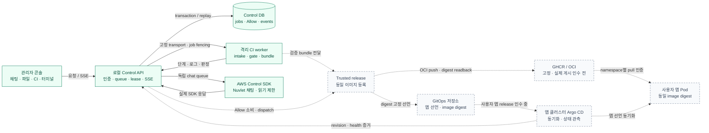
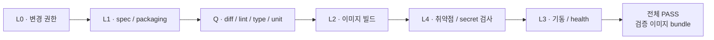

# RAILSHOT · Team Jasmin

**로컬 웹앱을 올리면 AI가 필요한 수정을 제안하고, 실제 CI 검사를 통과한 동일 이미지를 클라우드에 배포하는 시스템.** SoftBank Hackathon 2026의 “One Action, Infinite Clouds”를 목표로 개발하고 있습니다. 플랫폼 가제는 RAILSHOT, 콘솔의 대화 도우미는 Nuvlet Bot(누블렛)입니다. `.jasmin/` 등 기존 내부 이름은 유지합니다.

현재는 **관리자 한 명이 사용하는 로컬 콘솔과 실제 원격 CI·SDK 채팅을 연결한 PoC**입니다. 모든 클라우드·모든 앱의 원터치 배포가 완성된 상태는 아닙니다. 아래는 **2026-10-01 22:25 KST / 13:25 UTC**에 확인한 소스와 보존된 실행 증거 기준입니다.

## 현재 어디까지 동작하나요?

| 원래 담당 범위와 제품 연결 | 확인된 결과 | 남은 완료 조건 |
|---|---|---|
| **CI 핵심** | 격리된 GCP CI에서 정상 fixture 10종의 전체 gate PASS. 같은 공통 코드로 AWS CI VM에서도 npm-js 전체 6단계 PASS(81.3초). 실제 Codex source/packaging 수정 후 같은 gate 재검증 | 임의 업로드 전체 지원을 뜻하지 않음. 지원 범위·실패 사례는 [CI 검증 원장](platform/scenarios/ci-validation.md)에서 관리 |
| **AWS · Terraform** | AWS control VM에서 Codex SDK 구독 인증·실제 응답/수정. AWS/GCP/Azure 관리자 plan/apply 코드와 로컬 검사 | **AWS의 새 앱 스택을 처음부터 배포하는 E2E 미검증**. 제품 workspace allocator·상위 인프라 CRUD 연결 미구현 |
| **Argo bootstrap** | GCP 앱 노드의 k3s·Cilium·Argo CD·KEDA 설치, 보존 디스크와 stop/start 후 readiness 확인 | AWS 앱 스택 bootstrap 인수, 실제 사용자 앱의 revision·image digest·공개 URL 검증 |
| **CodeBuild** | 고정 플랫폼 commit의 release 전용 publisher·Terraform·durable dispatch 구현, 로컬 회귀 PASS | 첫 native 빌드의 이미지 게시 실패·UNKNOWN 보존. 진단 보존 회귀 PASS, GHCR 결정 뒤 ECR 추가 실행 보류. 제품 Allow와 CodeBuild의 별도 연결은 미완료 |
| **CD · Allow** | 현재 CI/bundle 검증→계획→Allow 소비와 job 제출의 원자적 transaction→release dispatch 구현·SQLite/PostgreSQL/HTTP 회귀 PASS | **실제 공개 배포 인수 미완료**. 현재 콘솔의 release transport는 미설정이며 GitOps 접근 404가 해결되지 않음. private registry 준비가 없으면 Allow 소비 전 차단 |
| **이미지 레지스트리** | GHCR/OCI를 제품 기본으로 결정. 기존 공통 publisher 재사용, trusted pull Secret 이름을 앱/migration 렌더에 연결 | **namespace Secret 설치·실제 GHCR push/pull 미검증**. 설치 경계가 연결되기 전 private release는 차단 |
| **이미지 캐시** | CI BuildKit volume 재사용, 앱·migration digest와 `Always` pull 정책으로 노드 layer 재사용 | GHCR 원격 build cache·cold/warm 성능 미검증. 이미지/bundle 총 보존 정책 및 tenant 재할당 검증은 GAP-045 |
| **LKG 복구** | 강한 배포 검증 후 정상 선언 저장, 앱 경로만 새 커밋으로 복원, 같은 검증 재수행 구현·로컬 회귀 | **실제 앱 배포·복원 인수 미완료**. 제품 rollback 선택 UI와 DB 데이터 복원은 별도 |

콘솔 API·SSE·영속 job 상태·제어권 전환·SDK 채팅은 구현돼 있습니다. 현재 연결 대상 GCP CI VM은 22:07 KST에 예약 종료됐으며 마지막 PASS bundle은 보존했습니다. 다만 **콘솔 CI는 현재 `--max-attempts 0`으로 실행**하므로 자동 코드 수정을 수행하지 않습니다. CLI로 확인한 SDK 수정 성공과 콘솔 기능을 구분합니다. 최신 세부 상태는 [통합 계획의 실행 기록](platform/CONTROL-PLANE-PLAN.md#77-2026-10-01-구현-증분과-남은-검증)과 [클라우드 검증 기록](platform/scenarios/cloud-validation.md)을 따릅니다.

**최근 실제 검증:** CI VM 재부팅 후 격리 증거 자동 재생성(21:08), 새 CI 실행의 6단계 PASS·실시간 진행률·품질 로그 단계 일치(21:28), SDK 실패의 명시적 상태 복구와 새 대화·완료 설명 응답을 확인했습니다. 이후 재시작으로 끊긴 대화도 기존 원격 PASS 결과를 대조해 실제 UI에서 복원했으며 모델 재호출은 없었습니다. 새 SDK 응답은 구조화된 12개 노드/12개 연결의 SVG 설명도로 표시됐습니다. 별도 브라우저 시험에서는 이전 페이지 추가·동시 대화 도착 후 112개 메시지의 순서/중복과 1px 이내 스크롤 앵커를 확인했습니다. 과거 UNKNOWN과 원래 실패는 유지합니다. 21:35 이후 GitOps 접근 404·Argo root Degraded는 여전히 별도 장애이며 제품 전체 E2E를 완료했다고 표시하지 않습니다.

## 시스템 구조

실선은 현재 연결된 실행·관측 경로, 점선은 실제 release 인수가 남은 연결입니다. CI에는 모델 인증·registry push·GitOps 쓰기·인프라 변경 자격을 주지 않습니다.



사용자는 폴더를 올리고 검사 구성을 확인합니다. 펫 메뉴에서 컴퓨터를 열면 같은 대화 옆에 실제 CI 로그와 파일을 봅니다. 사람이 제어권을 가져오면 활성 CI와 충돌하는 명령을 막고, 반환한 뒤 봇 실행을 다시 허용합니다. 준비 결과·전체 CI 결과·배포 결과는 각각 다른 상태입니다. 채팅은 관측된 상태를 설명하며, 대답 자체가 승인이나 배포 실행은 아닙니다. 토폴로지 제안도 **DRAFT·미반영**으로 표시하고 자동 적용하지 않습니다.

현재 API는 loopback의 **단일 관리자 범위**입니다. 다중 사용자 hosted 서비스, VM 자동 할당, 원격 GUI 스트리밍을 지원한다고 표시하지 않습니다. 상위 구조와 권한은 [플랫폼 소개](platform/README.md), [요청·배포 경로](platform/TOPOLOGY.md), [네트워크 경계](platform/ZERO-TRUST.md)에 있습니다.

## CI는 무엇을 검사하나요?

게이트 순서는 [공통 실행 계약](platform/execution.py)의 `L0 → L1 → Q → L2 → L4 → L3`입니다.



- 기존 manifest·lock·wrapper·검사 설정을 우선합니다. 없는 일부 checker는 run 전용으로 준비하며 업로드의 dependency·lock을 조용히 덮어쓰지 않습니다.
- 필수 테스트 0개, 설정·secret 누락, 검사를 실행하지 못한 상태는 PASS가 아닙니다. 실패 stage와 진단·도구 판본·해결 artifact를 보존합니다.
- 허용된 CLI 수정 흐름에서는 SDK가 JSON patch를 제안하고 공통 writer와 같은 gate가 다시 판정합니다. 기본 권한은 packaging이며 source 수정은 trusted 호출자가 별도로 허용해야 합니다. 테스트·lock·검사 설정은 보호합니다.
- release bundle은 source/spec/verdict hash와 실제 image ID에 묶입니다. CD가 Dockerfile을 다시 빌드해 다른 이미지를 배포하지 않도록 검사합니다.
- 모델 호출 결과가 불확실하면 자동 재호출하지 않습니다. 완료 checkpoint 재개와 SDK session ID 기록은 구현돼 있지만 native 대화 resume와 모든 외부 부작용의 자동 복구까지 뜻하지 않습니다.

지원 옵션, 실제 정상·실패 수치와 재현 명령은 [CI 검증 원장](platform/scenarios/ci-validation.md), 권한과 실패 판정은 [CI 구현 계약](platform/scenarios/ci-pipeline.md)을 참고하세요.

## 코드와 문서 지도

| 경로 | 역할 |
|---|---|
| [`console/`](console/) | 프레임워크 없는 HTML/CSS/JS 콘솔, 실제 API/SSE 표시, 펫·토폴로지 초안 |
| [`platform/control/`](platform/control/) | HTTP/SSE, 영속 kernel, 명시적 DB migration, 원격 worker·SDK chat·release adapter |
| [`platform/poc/intake.py`](platform/poc/intake.py) · [`platform/gate/`](platform/gate/) | 업로드 경계, build-root 준비, 검사·이미지 bundle |
| [`platform/runner/`](platform/runner/) · [`platform/loop/`](platform/loop/) | 공급자 SDK 공통 경계, 제한된 patch, 반복 상한·checkpoint·resume |
| [`platform/render/`](platform/render/) · [`platform/schemas/`](platform/schemas/) | 검증된 앱 spec에서 Kubernetes 선언 생성, DB·autoscaling 계약 |
| [`platform/infra/`](platform/infra/) · [`infra/terraform/`](infra/terraform/) | 관리자 대상·계획·비용 예약과 AWS/GCP/Azure 기반 자원 모듈 |
| [`infra/ansible/`](infra/ansible/) | control·자격 없는 CI worker·앱 노드 설치와 네트워크 경계 |
| [`gitops-template/`](gitops-template/) · [`ci/`](ci/) | Argo bootstrap/tenant 선언, release workflow 템플릿·배포 관측 |

설계 문서는 다음 항목을 정본으로 사용합니다.

- [PRD](platform/PRD.md): 사용자 요구와 목표 제품 범위
- [Control Plane 통합 계획](platform/CONTROL-PLANE-PLAN.md): 작업 순서·R&R·인수 조건·현재 상태
- [인프라 인터페이스](platform/contract/infra-interface.md): Terraform/guest 구성의 소유권, plan·Allow·operation·자원 수명
- [관측성 계약](platform/contract/observability.md): typed error·이벤트·재시도·UNKNOWN 의미
- [CD 실행 전제](ci/README.md): trusted runner·Argo 내부 관측·GitOps revision 검증
- [레지스트리 계약](platform/contract/registry.md): GHCR 고정·OCI 공통화·3계층 캐시·권한·수명·실제 인수 상태
- [DB와 migration](platform/scenarios/db-migration.md) · [자동 확장](platform/scenarios/autoscaling.md): 현재 구현과 미지원 범위

## 로컬에서 확인하기

저장소 루트에서 실행합니다. Python 3.13과 `uv`를 사용하며 control 의존성은 [고정 requirements](platform/control/requirements.txt)를 따릅니다. 아래 검사는 모델·클라우드 실행 없이 로컬 분기와 계약을 확인합니다. 실제 Docker/SDK/CD 결과를 대신하지 않습니다.

```bash
uv run --no-project --python 3.13   --with-requirements platform/control/requirements.txt   python -m unittest discover -s platform/control -p 'test_*.py'

uv run --no-project --python 3.13   --with-requirements platform/control/requirements.txt   python platform/gate/gate.py --self-test

uv run --no-project --python 3.13   --with-requirements platform/control/requirements.txt   python -m unittest discover -s ci -p 'test_*.py'
```

연결 설정 없이 로컬 콘솔의 API·영속 상태를 확인하려면 DB migration을 **명시적으로 먼저** 실행합니다. 서버 시작은 테이블을 자동 생성하지 않습니다.

```bash
RAILSHOT_STATE="$(mktemp -d)"
uv run --no-project --python 3.13   --with-requirements platform/control/requirements.txt   python platform/control/database.py upgrade   --database-file "$RAILSHOT_STATE/state.sqlite3"

uv run --no-project --python 3.13   --with-requirements platform/control/requirements.txt   python platform/control/server.py --state-dir "$RAILSHOT_STATE" --port 8787
```

서버가 출력하는 일회용 bootstrap URL을 같은 컴퓨터의 브라우저에서 엽니다. URL의 인증 fragment를 공유하거나 저장소에 넣지 않습니다. 이 실행에는 remote worker·SDK transport가 없으므로 **연결 불가/미설정**으로 나타나는 것이 정상입니다. 실제 연결은 관리자가 검증한 private config와 대상 자격 경계를 필요로 하며 UI 입력으로 클라우드 자격을 받지 않습니다.

전체 CI를 실행하려면 Docker/Buildx·검증된 CI 네트워크·scanner 등 별도 Linux worker 전제가 필요합니다. [CI 실행 계획](platform/scenarios/ci-validation.md#4-실행-순서와-현재-명령)과 [인프라 설치 문서](infra/README.md)를 따르세요. README의 로컬 명령은 VM 생성·배포·모델 호출을 시작하지 않습니다.

## 무엇을 완료로 보나요?

**로컬 검사 통과 → 실제 CI 통과 → 동일 이미지 등록 → GitOps 반영 → Argo revision/health 확인 → 공개 URL 확인**을 구분합니다. 실제 배포 완료에는 승인 대상과 배포한 source/spec/image digest가 같고, 올바른 앱의 revision과 외부 응답까지 확인한 receipt가 필요합니다.

현재 다음 인수 순서는 **trusted release 연결과 실제 CD → 앱별 LKG → 원래 AWS 앱 스택·CodeBuild 경로 검증**입니다. stale/만료 Allow, 중복 요청, dispatch 직후 장애, 다른 앱 동시 변경, 복구 후 health를 함께 검사해야 합니다. 사용자 DB 복원이나 VM 재생성은 앱 선언 rollback으로 대신하지 않습니다. 최신 우선순위와 미완료 항목은 [통합 계획 §7](platform/CONTROL-PLANE-PLAN.md#7-최종-통합-사양작업-순서검증-절차)에 모읍니다.

공개 문서에는 판정과 재현 계약만 남깁니다. 원문 인증·개인 계정·내부 주소·Terraform state·비공개 조사 원자료는 커밋하지 않습니다. 과거 실행 증거는 당시 source/fixture 판본에 한정하며, 설치 성공·화면 표시·모델의 완료 문장을 전체 제품 성공으로 확대하지 않습니다.

개발 협업 규칙은 [AGENTS.md](AGENTS.md)를 따릅니다. 변경은 `feature/* → develop → main`의 PR 흐름으로 통합합니다.
