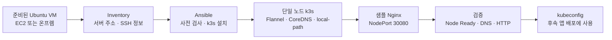

# Jasmin
SoftBank Hackathon Jasmin team Repo for One Touch Depolyment

## Kubernetes 구성 모듈

[`infra/ansible`](infra/ansible/README.md)은 **준비된 Ubuntu 서버 1대에 k3s를 설치하고
앱 실행까지 검증하는 모듈**입니다. 서버 생성이나 전체 원클릭 배포 플랫폼은 이 모듈의 범위 밖입니다.



| 항목 | 현재 구현 |
| --- | --- |
| 대상 | Ubuntu 22.04/24.04, amd64/arm64, systemd, 단일 노드 |
| 설치 | 버전 고정 k3s 바이너리 + SHA256 검증 + systemd |
| 보호 장치 | 기존 k3s 덮어쓰기 방지, 버전·CIDR 변경 거부 |
| 샘플 앱 | Nginx. 챗봇 대신 배포·네트워크 검증용으로 사용 |
| 검증 이력 | 2026-10-01 EC2 Ubuntu 24.04에서 설치, DNS, 외부 HTTP 200 확인 |
| 미포함 | VM 생성, Cilium, HA, GPU, Argo CD, HTTPS·도메인 자동 구성 |

### 시작하기

```bash
git clone --branch feature/ansible_JB https://github.com/Jasmin-Softbank/Jasmin.git
cd Jasmin/infra/ansible
```

이후 [실행 가이드](infra/ansible/README.md#실행)에 따라 Ansible 설치와 inventory 설정을 진행합니다.
실제 서버 주소, SSH 개인키, kubeconfig는 저장소에 포함하지 않습니다.
