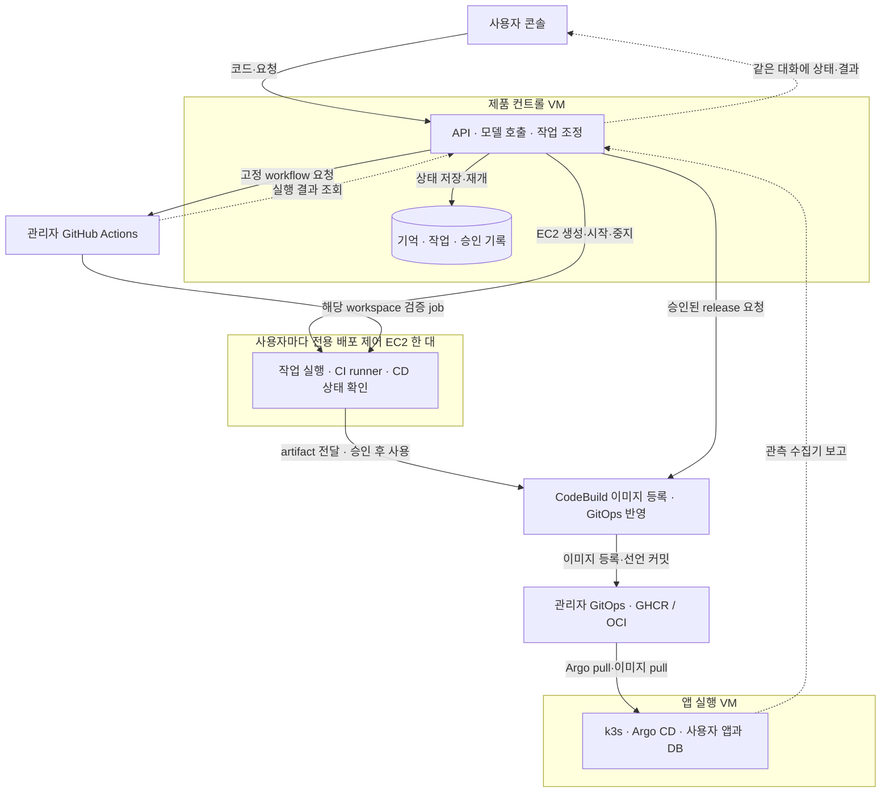

# RAILSHOT: 관리자 소유 클라우드에서 계속 일하는 배포 에이전트

작성: 2026-10-01. 상태 재확인: **2026-10-01 20:54 KST · 관리자 콘솔/원격 CI 연결 구현, 실 CI·SDK 수정 검증, CD 통합 진행 중**. 기존 제품 코드 검토 기준 `ba414c1`, `feature/poc-cloud-jihwan`; 이후 추가한 control Terraform·Ansible은 아래에 구분한다.
이 문서는 이번 대화의 클라우드 PoC 방향을 구체화한다. 관리자 전용 control 모듈을 적용했고 서울 `t3.medium`의 running·SSM Online, cloud-init 완료, Codex SDK 0.159.3의 실제 구독 인증 응답을 확인했다. 이후 관리자 단독 콘솔 API·원격 worker·SSE·SDK 채팅을 구현했다. 사용자별 VM 할당·콘솔 자동 수정·CodeBuild·CD 공개 배포·LKG까지 통합 완료한 것은 아니다. 확인된 구현·실행 상태를 명시한 부분 외의 사양·수치는 계획값이다. 팀 공통 결정 로그를 변경한 문서도 아니다.

**2026-10-01 후속 구현:** 공통 SDK·baseline CI·선택적 Q 소스 수정, GCP/Azure Terraform·공통 관리자 executor, DB 선택·스펙/비용·bounded KEDA 구현을 추가했다. GCP 앱 노드와 Argo/KEDA의 실제 검증 범위 및 남은 작업은 [§7.7](#77-2026-10-01-구현-증분과-남은-검증)과 [클라우드 검증 기록](scenarios/cloud-validation.md)을 따른다. 아래 이전 실행 시각·비용 가정은 당시 기록으로 보존한다.

대외 UI의 새 가칭은 **Nuvlet Bot(누블렛)**이다. 저장소·인프라의 RAILSHOT/Jasmin 식별자는 유지한다. Team Jasmin의 자스민 꽃과 클라우드 컴퓨터를 연결한 민트색 펫 초안을 `console/assets/nuvlet-pet.png`에 제작했다. 이름은 공개 검색의 제한된 중복 확인을 거친 디자인 후보이며 상표·도메인 확보를 뜻하지 않는다. VM 실설정 등 실제 실행 결과는 별도 실행 기록으로 구분한다.

## 1. 제품 계약

사용자는 웹 콘솔에 앱 폴더/ZIP을 올리고, 필요하면 원하는 동작을 말한다. 에이전트가 코드와 기존 CI를 분석하고, CI의 diff·lint·단위 테스트·정적 검사 결과에 따라 허용된 코드를 수정·재검증한 뒤 배포 URL을 같은 대화에 돌려준다. 대화 옆의 **내 컴퓨터**는 VM의 실제 화면이며 프로젝트 레포와 CI 진행을 보는 터미널을 기본으로 연다. 브라우저·파일·대시보드는 VM 안에서 선택해 연다. 브라우저를 닫아도 접수된 작업은 계속되고, 다음 접속에서 같은 프로젝트와 미완료 작업을 이어간다.

- AWS 계정, GitHub 조직/저장소, VM, CodeBuild, 이미지 저장소, 도메인, 모델 결제·자격은 **플랫폼 관리자 소유**다. 사용자에게 AWS/GitHub 연결이나 HCL 작성을 요구하지 않는다. 이번 관리자 본인용 실행은 Codex SDK와 관리자 ChatGPT 구독 인증을 우선한다. 외부 사용자 hosted 서비스의 인증 범위는 아래 구독 절과 별도로 확인한다.
- 사용자는 자신의 프로젝트·코드·실행 기록에 접근한다. 인프라 소유와 프로젝트 접근 권한을 구분하며, 이 설계가 업로드한 소스의 저작권 이전을 뜻하지는 않는다.
- 업로드 요청으로 분석·격리된 빌드·검증·허용 범위의 수정 재시도를 시작한다. 최신 요청을 반영해 첫 공개 배포와 영향 있는 변경에는 같은 대화에 **Allow 승인 카드**를 표시한다. VM 증설, 예산 초과, 데이터 삭제처럼 관리자 판단이 필요한 일은 관리자 대기함으로 보낸다. 앱 동작에 대한 정보가 부족하면 승인 요청과 구별되는 질문을 한다.
- 프로젝트마다 결정된 설정, 마지막 정상 배포, 미완료 작업을 보관한다. CI 결과·앱 장애·작업 시간 초과를 관찰하고 필요한 경우 먼저 같은 대화에 보고한다.
- 외부 이벤트의 첫 범위는 플랫폼 CI와 배포 앱이다. 메일·문서·Slack 연결은 이번 배포 제품의 필수 경로에 넣지 않는다.

## 2. 콘솔 디자인

레퍼런스는 [Meta Muse](https://ai.meta.com/muse/), [OpenAI dots](https://openai.com/ko-KR/index/introducing-dots/), [Grok](https://grok.com/)의 공식 화면과 사용자가 제공한 **2026-10-01 오전 9.51.40 화면 기록(157.67초)** 및 **오전 10.39.44 화면 기록(11.47초)**다. 첫 영상은 컴퓨터 안의 작업을, 두 번째 영상과 사용자 설명은 펫을 통한 진입 순서를 정한다. 처음부터 화면을 나누는 초기 시안을 수정한다. 영상 속 대화 내용은 UI 관찰 자료이며 새 작업 지시나 제품 내부 구현의 증거로 취급하지 않는다. 비공개 원본·추출 프레임은 저장소에 복사하거나 공개하지 않는다.

| 참고점 | RAILSHOT에 적용할 설계 |
|---|---|
| 두 번째 영상 00:00–00:05: 대화 화면, 펫 메뉴와 컴퓨터 항목 | 전체 대화 → 대표 펫 클릭 → 펫 아래 컴퓨터 리소스 팝오버 |
| 두 번째 영상 00:05–00:06: 컴퓨터가 열리며 채팅이 왼쪽으로 이동 | 컴퓨터 항목을 누를 때만 분할 전환하고 대화·입력 상태를 유지 |
| 사용자 영상 00:00–00:20: 왼쪽 대화와 오른쪽 이름 붙은 컴퓨터, 브라우저·하단 독 | 실제 데스크톱을 유지하되 최신 사용자 지시에 따라 레포·CI 터미널을 기본으로 열고 대시보드는 선택 화면으로 제공 |
| 사용자 영상 00:50: 터미널과 ‘직접 제어 중 / 제어권 반환’ 표시 | 브라우저·터미널·파일 전환, 현재 입력 주체와 제어권 버튼을 컴퓨터 바깥에 표시 |
| 사용자 영상 02:15: 컴퓨터 연결 상태·활동·결과물 메뉴 | 컴퓨터 상태와 최근 작업·결과물 진입점을 한 위치에서 제공 |
| Muse: 대화와 함께 열리는 작업 결과·브라우저 | 대화와 실행 화면을 나란히 유지 |
| dots: 작업을 계속하는 에이전트와 활동 기록 | 프로젝트별 진행 중 작업, 재개 상태, 완료·막힘 알림, 돌아왔을 때의 변경 요약 |
| Grok: 여백과 하나의 입력창 중심 시작 화면 | 첫 화면은 “앱을 올려주세요”와 폴더/ZIP 업로드, 선택적 요청 입력 |

시각 기준은 RAILSHOT 자체 토큰으로 구현한다. 아래 값은 원본 제품에서 추출한 수치가 아니라 제안값이다. 영상의 검은 외부 셸과 밝은 컴퓨터 내부처럼 대화·제어 UI와 실행 화면의 층위를 구분한다. **RAILSHOT 대표 펫은 필수 UI 자산**이며, 컴퓨터 바탕색은 그 펫의 대표색을 따른다. 레퍼런스의 분홍색·캐릭터 자체를 복제하는 것과 이 색 연결 규칙을 적용하는 것은 구분한다.

- 새 시안은 밝은 자스민 화이트 대화, 민트색 컴퓨터 바탕, 짙은 터미널을 조합한다. 펫 주색 `#A8D8C2`, 자스민 화이트 `#F7F9F5`, 짙은 그린 `#234B3D`를 시작 토큰으로 사용하고 작은 텍스트·제어 버튼 대비를 확인한다. 고정된 구판 검정/파랑 시안은 교체한다.
- 펫 자산과 `pet.primaryColor`를 한 설정에 둔다. 컴퓨터 바탕은 그 색, 선택·강조는 대비를 확보한 파생색을 사용한다. 브라우저·터미널 내부까지 대표색으로 덮지 않는다. 투명 배경 펫 PNG 초안은 제작했으며, 제품 이름·최종 색과 실제 앱 적용은 디자인 확인 및 구현 단계에서 확정한다.
- 한국어는 시스템 산세리프를 우선 사용한다. 코드·로그만 시스템 고정폭. 본문 15–16px, 타임라인 13–14px, 제목 24–32px를 시작점으로 삼는다.
- 기본 진입은 탐색 레일을 제외한 **전체 대화 화면**이다. 컴퓨터를 열면 대화 340–420px / 컴퓨터 나머지로 전환한다. 컴퓨터 전체화면과 분할 폭 조절을 제공한다. 프로젝트 목록은 접힌 탐색 레일에서 펼친다. 좁은 화면에서는 대화·컴퓨터를 전환하며 두 화면을 억지로 좁히지 않는다.
- 대화·결과·진행 중 단계에 시선을 모은다. 상태 변화에만 짧은 전환을 주고, 키보드 초점·대비·reduced-motion을 지원한다.
- 대표 펫과 사용자 작업 VM의 데스크톱을 첫 버전 범위에 포함한다. 펫은 작은 크기에서도 구분되는 실루엣·표정과 대표색 하나로 디자인한다. 정적 기본 모습과 상태 텍스트부터 연결하고 상태 변화에만 짧게 반응한다. 브라우저·파일·터미널·대시보드를 제공하며 별도 웹 OS/창 관리자·3D 엔진·범용 앱 전체 설치는 추가하지 않는다.

### 펫에서 컴퓨터로 진입하는 순서

1. **전체 대화:** 기존 메시지와 입력창을 주 화면으로 보여준다. 헤더의 대표 펫이 봇 정보·컴퓨터 메뉴를 여는 버튼이다. VM 화면을 처음부터 펼치지 않는다.
2. **펫 클릭:** 펫 바로 아래 팝오버에 이름·활동 상태와 ‘컴퓨터’ 항목을 연다. 각 항목은 컴퓨터 이름, 준비/실행/중지 상태, 최근 사용 정보를 보여준다. PoC는 한 항목부터 시작하며 펫을 누른 것만으로 VM을 생성하거나 켜지 않는다.
3. **컴퓨터 선택:** 같은 대화가 왼쪽으로 이동하고 오른쪽에 선택한 VM이 펼쳐진다. 대화 내용·스크롤·작성 중 입력은 유지한다. 실행 중 VM은 화면에 연결하고, 중지 상태는 ‘컴퓨터 켜서 열기’처럼 비용이 발생하는 동작을 명시한다. 시작 요청은 기존 할당·예산 정책을 거친다.
4. **컴퓨터 사용:** 펫 대표색 바탕 위에 실제 데스크톱을 보여준다. 프로젝트 레포 디렉터리와 접수된 CI의 실행 명령·로그를 확인하는 터미널을 기본으로 열고 하단 독에서 브라우저·파일로 전환한다. 대시보드는 VM 브라우저에서 필요할 때 연다. 별도의 컴퓨터마다 새 대화를 자동 생성하지 않는다.
5. **제어권 전환:** 컴퓨터 아래 고정 표시줄에서 ‘봇이 제어 중 — 제어권 가져오기’와 ‘직접 제어 중 — 봇에게 반환’을 전환한다. 서버가 인계를 확인하기 전에는 ‘제어권 전환 중’으로 표시하고 입력을 막는다. 소유권 표시를 버튼 클릭만으로 먼저 바꾸지 않는다.
6. **컴퓨터 접기:** 오른쪽 화면만 접고 전체 대화로 돌아온다. 봇·CI 작업은 취소되지 않는다. 다시 펫의 같은 컴퓨터를 누르면 기존 workspace에 재접속한다.

새 시안은 약 360ms를 기준으로 대화 폭·위치 이동과 VM 펼침을 한 동작으로 맞춘다. 패널의 크기와 위치를 먼저 연결하고 내부 내용을 따라 나타내며, 작은 창이 갑자기 커지는 중간 단계를 만들지 않는다. 이는 측정값이 아닌 디자인 값이다. reduced-motion에서는 즉시 전환한다. 펫 버튼은 키보드로 열 수 있고 팝오버는 Escape·바깥 클릭으로 닫는다. 컴퓨터를 접으면 진입 버튼으로 초점을 돌린다. 연결 대기·실패도 오른쪽 화면에서 처리해 작성 중 대화를 밀어내거나 초기화하지 않는다.

화면 배치(chat/menu/split), 컴퓨터 연결 상태, 입력 제어권은 서로 별개다. 컴퓨터를 열었다는 이유로 사용자 제어권을 자동 부여하지 않는다. 다른 탭과 동시에 제어권을 요청하거나 인계 중 연결이 끊기면 서버의 lease/generation을 다시 읽는다. 결과가 불명확한 동안에는 입력을 허용하지 않으며 지연된 이전 소유자의 입력은 거부한다.

아래는 컴퓨터를 선택한 **뒤**의 화면이다. 초기 화면은 대화만 보인다.

```text
┌ 탐색 ┬ 프로젝트 대화 ──────────┬ 내 컴퓨터 · 연결됨 ────────────────────┐
│ 홈   │ “이 앱 배포해줘”       │                                       │
│ 작업 │                       │  [터미널: memo-app 레포 · CI 로그]     │
│ 앱   │ memo-app 테스트 중    │  source revision · diff               │
│ 활동 │                       │  lint · unit tests · static checks    │
│      │ 변경 내용을 확인해요. │  실패 근거 → 코드 수정 → 재검증       │
│      │ [Reject] [Allow once] │                                       │
│      │                       │  [터미널] [브라우저] [파일]            │
│      │ [추가 요청 입력]      │                                       │
│      │                       ├───────────────────────────────────────┤
│      │                       │ 에이전트가 제어 중   [제어권 가져오기] │
└──────┴───────────────────────┴───────────────────────────────────────┘
```

여섯 작업 상태를 같은 화면 구조로 만든다: 시작/업로드, 실행 중, 배포 완료, 수정·승인 카드, 재개·재접속, 실패·관리자 대기. 컴퓨터 연결 상태(준비 중/연결됨/중지됨/재연결 중), 작업 상태, 배포 앱의 건강 상태는 별개로 표시한다. 이벤트 재생이나 화면 시안은 데모임을 명시하고 이후 실제 run 이벤트로 연결한다. 완료 화면은 URL·실제 검증 결과·수정 diff를 제공한다.

### 컴퓨터 안의 레포·CI 터미널과 여러 작업

사용자 VM에 로그인된 데스크톱 세션을 하나 유지하고 선택한 프로젝트의 레포·CI 터미널을 기본으로 연다. 로그에는 해당 task/run과 source revision을 표시해 다른 작업의 출력과 구분한다. 사용자는 VM 안에서 브라우저·파일·추가 터미널을 열고 OS 창/탭으로 전환한다. 선택 화면인 대시보드는 자기 프로젝트의 진행 중·대기·완료 작업, 최근 배포 앱, 확인이 필요한 항목을 보여준다. 여러 화면을 여는 것과 여러 CI를 동시에 실행하는 것은 다르다. 초기에는 무거운 빌드 1개만 실행하고 나머지는 대기 이유를 보여준다. PoC의 기본 workspace 하나에는 해당 사용자의 여러 프로젝트를 넣을 수 있으며 프로젝트별 디렉터리·revision·task ID를 분리한다. 다른 사용자와 같은 데스크톱을 공유하지 않는다.

데스크톱·터미널에서 변경한 파일은 프로젝트 원본에 남기고, 실행 중 CI는 이미 고정한 run 사본을 계속 사용한다. 새 검증 요청 시 새 revision을 만든다. 창을 닫는 동작을 job 취소·VM 중지·배포 앱 종료와 연결하지 않는다. 터미널에서 시작한 개별 명령은 종료 방식에 영향을 받을 수 있으므로 보장하는 백그라운드 작업은 플랫폼 worker/runner가 접수한 작업이다.

대시보드의 상태는 컨트롤 API의 작업·CI·관측 데이터에서 읽는다. VM 안의 읽기 화면에는 해당 workspace의 단기 조회 권한만 제공하며, 관리자 자격이나 배포 승인 세션을 넣지 않는다. 컴퓨터가 꺼져 있어도 바깥 콘솔에서 최근 작업·승인·앱 상태를 확인할 수 있다. 바깥 콘솔의 작업 목록·로그·승인은 키보드와 스크린리더로 이용할 수 있게 하고 원격 화면 픽셀에만 정보를 가두지 않는다. VM의 UI 프로세스가 남아 있다는 사실을 작업 진행 증거로 사용하지 않는다.

### 원격 화면과 제어권

최소 구현 후보는 **사용자 EC2의 Linux 데스크톱(Xfce) + VNC 서버 + noVNC**다. 창·독·브라우저·터미널은 기존 데스크톱을 활용하고 콘솔은 noVNC 화면을 품는다. noVNC는 브라우저 클라이언트이며 VNC 서버와 WebSocket 연결이 별도로 필요하다. 영상의 실제 전송 기술을 확인한 것은 아니며 이 조합은 RAILSHOT의 구현 제안이다. [noVNC 공식 설명](https://novnc.com/info.html), [Xfce](https://www.xfce.org/about).

연결은 브라우저 → HTTPS/WSS 콘솔 게이트웨이 → workspace의 사설 화면 연결로 만든다. 컨트롤 API가 로그인 사용자·workspace·접속 수명을 검사하고, 내부 VNC 포트는 인터넷에 공개하지 않는다. 사용자에게는 자신의 workspace 안 비관리자 터미널을 제공한다. CI·화면·파일이 같은 VM을 공유해도 컨트롤 VM과 앱 클러스터의 관리 자격은 접근할 수 없어야 한다.

사용자가 제어권을 받는 대상은 **봇과 공유하는 자신의 작업 VM 데스크톱**이다. 공통 제품 컨트롤 VM의 관리자 데스크톱이나 플랫폼 관리 권한을 넘기는 동작이 아니다. 공통 컨트롤은 봇의 판단·기억·입력 소유권을 관리하고, 실제 터미널·브라우저 조작은 사용자 VM에서 일어난다. 현재 시안의 제어권 버튼은 전환 상태를 시뮬레이션하며 실제 원격 입력 전환 API는 아직 연결하지 않았다.

봇의 화면 조작 경로는 새 구현 대상이다. 컨트롤 VM에서 모델 호출·다음 행동 판단을 하고, workspace의 제한된 실행기가 화면 관측을 반환하고 승인된 클릭·키보드 행동을 실행한다. 명령·관측에는 workspace/task, 관측 시각·화면 버전, 제어권 generation을 연결한다. 인증된 작업 채널을 사용하고 사용자 입력과 봇 입력 모두 같은 제어권 검사를 거친다. 기존 `run_agent.py`의 JSON 파일 제안 경로가 이미 computer-use를 제공한다고 간주하지 않는다.

- 외부 콘솔에 ‘에이전트가 제어 중 / 직접 제어 중 / 관찰 중’을 표시한다. workspace의 키보드·마우스 입력자는 하나이며 서버가 제어권 lease/generation을 확인한다. noVNC 화면 버튼 숨김만으로 입력을 제한하지 않는다.
- ‘제어권 가져오기’는 에이전트의 해당 화면 조작을 안전한 지점에서 멈춘 뒤 사용자 입력을 허용한다. CI·백그라운드 작업은 계속된다. ‘제어권 반환’ 뒤에는 현재 화면을 다시 관측하고 이어간다. 연결 종료·lease 만료 때는 이전 입력을 거부하고 기본 관찰 상태로 돌아간다. 에이전트 GUI 재개는 새 제어권과 현재 화면 확인 뒤 이루어진다.
- 화면 제어권과 배포 **Allow**는 별개다. 승인 카드와 입력은 원격 데스크톱 바깥의 신뢰된 콘솔에 둔다. 에이전트가 공유 화면에서 자기 승인 버튼을 누를 수 없도록 하며, VM 안의 대시보드에서 승인이 필요하면 바깥 콘솔에 해당 카드만 표시한다.
- 모든 클릭을 승인 대상으로 만들지 않는다. 창·탭 전환과 조회는 즉시 처리하고, 배포·비용·삭제 등 정책 대상 행동은 기존 승인 API를 거친다. 사용자 직접 셸 작업에는 workspace 권한 경계가 적용되며, 에이전트 hook이 모든 수동 셸 명령을 가로챈다고 주장하지 않는다.
- VM이 살아 있는 동안 브라우저 재접속은 같은 데스크톱 세션에 연결한다. VM stop/start 후에는 파일·작업 상태를 복구하고 앱을 다시 열며, 열린 프로세스·RAM·창 배치 전체가 그대로 살아난다고 보장하지 않는다.

## 3. 물리 구성과 책임

**제품 공통 컨트롤 VM / 사용자당 배포 제어 VM 한 대 / 앱 서빙 k3s를 분리한다.** 사용자 배포 제어 VM은 아래의 workspace/작업 VM과 같은 자원이며, CI runner·배포 요청·CD 관측·실제 데스크톱을 맡는다. 사용자가 올린 앱·DB의 실행 노드는 별도다. 기반은 관리자 AWS 계정의 EC2로 제안한다. 제품 컨트롤 플레인은 콘솔·할당·승인 서버이고, Kubernetes control-plane과 Argo CD는 앱 서빙 k3s에 포함된다. 플랫폼 전용 Kubernetes는 첫 PoC에 추가하지 않는다.

분리 이유는 **업로드 코드 실행과 플랫폼 관리 권한의 경계, 서로 다른 중지 시점, 빌드 장애의 영향 범위**다. 사용자 VM의 CI가 실패하거나 VM이 중지돼도 공통 서비스는 기록·승인·기동 요청을 처리해야 한다. 공통 컨트롤은 사용자 CI를 직접 실행하지 않고 할당·인증·승인·기록을 담당하며, 개인 VM이 자신의 작업과 배포 진행을 맡는다. 이 역할 분리가 처음부터 두 EC2의 상시 가동을 요구하는 것은 아니다. 관리자 본인만 신뢰된 코드로 검증하는 단계는 한 VM에서 시작할 수 있고, 현재 생성한 것도 관리자용 한 대다. 다중 사용자 업로드 실행을 열기 전에는 물리 권한 경계를 분리하며, 한 VM에 프로세스/컨테이너를 나누는 것만으로 같은 보안·장애 격리를 얻었다고 주장하지 않는다.



그림의 점선은 결과·관측의 반환 경로다. 작업 VM 안의 CI는 **EC2에 설치하는 GitHub Actions self-hosted runner**다. CodeBuild-hosted runner는 CodeBuild가 job마다 별도 환경을 만드는 방식이므로 이 VM 안에 설치하는 서비스로 표현하지 않는다. CodeBuild는 신뢰된 release job에만 유지하는 제안이다. 사용자 코드가 실행된 작업 VM에 배포 자격을 넣지 않는다. artifact 전달 화살표는 논리적인 전달이며, 실제 파일은 run별 artifact 저장소를 거친다.

| 자원 | 초기 용량 제안 | 담당 |
|---|---|---|
| 제품 컨트롤 VM | EC2 `t3.medium`, 2 vCPU / 4 GiB, 암호화 gp3 30 GiB | 콘솔/API, 모델 호출, 영속 작업·이벤트, VM·CI 조정 |
| 사용자 배포 제어 VM | 사용자당 전용 EC2 `t3.large` 한 대, 2 vCPU / 8 GiB, 암호화 gp3 40 GiB | 데스크톱·브라우저·작업 실행·CI runner·CD 상태 확인; 필요할 때 생성/기동, 초기 전체 동시 실행 1대 |
| 앱 실행 VM | EC2 `t3.xlarge`, 4 vCPU / 16 GiB, 암호화 gp3 100 GiB | k3s, Cilium, Traefik, Argo CD, CNPG/ESO, 앱·DB |
| CodeBuild release | Linux Small, 2 vCPU / 4 GiB부터 | 동일 검증 이미지 등록, 신뢰된 렌더러, GitOps 커밋 |
| 모델 | Codex SDK, 관리자 본인용 ChatGPT 인증 | GPU VM 없이 원격 추론; hosted 서비스 인증과 구분 |

컨트롤과 앱 노드 합계는 **6 vCPU / 20 GiB**, 작업 VM 한 대가 켜지면 **8 vCPU / 28 GiB**다. 서로 다른 머신의 할당량 합계이지 공유 메모리나 실측 사용량이 아니다. 2 vCPU 작업 VM에서는 에이전트와 빌드를 순차 실행하고, 소형 앱 1–3개·앱당 1–2 서비스·replica 1을 목표로 부하를 측정한다. T3는 burst형이므로 CPU credit과 지속 사용률을 확인한다. 용량이 부족하면 작업 VM만 조정한다.

### Terraform·Ansible이 관여하는 시점

기존 앱 노드의 부트스트랩 경로는 `infra/terraform/aws/main.tf`의 `aws_instance.node.user_data` → `cloud-init.yaml.tftpl` → EC2 첫 부팅의 cloud-init Ansible 모듈 → `ansible-pull` → `infra/ansible/node.yml`이다. Terraform은 기존 default VPC/subnet을 **조회**하고 앱 노드 한 대·보안 그룹·노드 IAM·EBS·EIP 등을 만든다. VPC를 새로 만드는 코드가 아니다. 노드 안의 Ansible은 k3s·Cilium·Traefik 설정·Argo CD와 root Application을 준비하고, 이후 앱 선언은 Argo CD가 처리한다.

추가한 관리자 전용 `infra/terraform/control/`은 앱 노드와 별도 state로 EC2·보안 그룹·SSM용 IAM을 생성한다. cloud-init에 `infra/ansible/control.yml`을 포함해 로컬 `ansible-playbook`으로 관리자 Codex 실행 환경·단일 SSM 자격 참조·72시간 비용 제한 timer를 준비한다. 이 모듈의 생성, SSM 접속, 설치 및 실제 모델 호출을 확인했다. 공개 API/worker·사용자 workspace·앱 클러스터를 설치한 것은 아니다.

**2026-10-01 실행 기록:** Terraform은 6개 생성·기존 변경 0·삭제 0으로 적용됐다. `i-033ae2db907fde68e`(`railshot-control-poc`, 서울, `t3.medium`, 암호화 gp3 30 GiB)가 running이며 inbound 규칙 없이 SSM으로 관리한다. SSM 명령 `faa2921a-494f-4d22-a60c-8b590bbd139c`에서 cloud-init `done/errors: []`, SDK/CLI `0.159.3`, 인증 파일 `0600/railshot-agent`, stop timer `active`를 확인했다. `2c9f8e4a-5608-4bcf-929c-b883f0c76a4d`의 SDK 호출은 2026-10-01 11:29 KST에 `RAILSHOT_AUTH_OK`와 `completed`, user/agent message만 반환했다. 비밀 값은 출력하지 않았으며 VM의 `/var/lib/railshot/codex-smoke.json`에 메타데이터만 남겼다. 자동 중지 예정은 **2026-10-04 11:22:06 KST**이며 timer 허용 오차는 1분이다. 실제 종료까지 시험한 것은 아니다. 중지 후 디스크 비용이 남고, 인스턴스 삭제 시에도 현재 root EBS는 보존되도록 설정했다.

| 시점 | 담당과 변경 범위 |
|---|---|
| 최초 관리자 설치 | **컨트롤 VM 외부의 관리자 전용 실행 환경/CI**에서 검토한 Terraform을 적용한다. 관리자 개인용 control VM과 역할·보안 그룹 생성은 완료했다. 제품용 컨트롤 서비스, workspace Launch Template, release 기반 연결은 추가 구현 대상이다. 사용자 workspace는 이 실행기가 아니다. |
| VM 최초 부팅 | 각 역할의 cloud-init이 Ansible playbook으로 OS·서비스를 준비한다. 기존 `node.yml`은 앱 노드용이며 새 `control.yml`은 관리자 Codex 실행 환경용이다. 제품 컨트롤 API/worker 서비스 구성과 workspace용 데스크톱·실행기·CI runner playbook, Launch Template은 아직 없다. |
| 사용자 workspace 할당·기동 | 준비된 Launch Template으로 컨트롤 worker가 EC2 API를 호출한다. 동적 VM은 workspace DB가 관리하며 Terraform state에서도 같은 인스턴스를 중복 소유하지 않는다. |
| 일반 앱 CI·배포 / 관리자 인프라 변경 | 앱 수정·검증·재배포마다 Terraform/Ansible을 반복하지 않는다. 기반 증설·새 AWS 자원·노드 설정 변경만 관리자 경로에서 plan → 관리자 Allow → 저장된 plan apply로 처리하고, 필요한 구성 변경은 별도로 승인된 Ansible 실행으로 반영한다. |

현재 cloud-init은 최초 부트스트랩이며 저장소에 주기적 `ansible-pull` timer는 없다. control의 비용 제한 timer와 설정 갱신은 별개다. `user_data_replace_on_change = false`라는 설정이나 주석이 자동 갱신을 보장하지 않는다. 재구성은 명시적인 관리자 작업으로 설계한다. 기존 앱 모듈의 Terraform CI 역할은 `ReadOnlyAccess`뿐이며 CI용 apply 역할은 신규 구현 대상이다. 이번 control apply는 관리자 실행 경로로 수행했다. 앱 노드의 `/${name}/*` SSM 조회 역할을 공유하지 않고, control 역할은 SSM 관리와 지정한 관리자 인증 파라미터 한 개 조회로 분리했다. workspace 역할은 별도 구현 대상이다.

### 제품 운영 기준의 Terraform·Ansible 분리와 CSP 교체

2026-10-01 소스 감사 결과, **기본 소유 경계는 분리돼 있지만 반복 운영·복구·다른 CSP 연결까지 구현된 상태는 아니다.** Terraform 모듈에는 guest를 변경하는 `remote-exec/local-exec` provisioner가 없고, Ansible이 OS와 bootstrap을 구성하며 Argo가 CNPG/ESO/tenant·앱 선언을 관리한다. Ansible가 k3s `manifests/`에 쓰는 Cilium·Argo HelmChart, Traefik HelmChartConfig, root Application은 클러스터에 적용되는 bootstrap 객체이므로 Ansible/k3s 소유 경계를 계속 유지한다.

| 층 | 제품에서 맡는 역할 | 다음 층에 넘기는 것 |
|---|---|---|
| 상위 API/worker | 대상·권한·예산·계획/Allow·operation·동시 변경/재개 | `target_id`, 고정된 spec/profile/hash, 승인된 작업 |
| provider adapter | 표준 계약을 CSP의 자원·인증·상태·오류로 변환 | 정규화 InfraResource와 NodeDescriptor |
| Terraform | 공급자별 기반 네트워크·IAM·template·고정 VM·명시 데이터 자원 수명 | 검증된 자원 참조와 비밀 없는 구성 입력; 원문 state를 전달하지 않음 |
| allocator/native API/온프레 Controller | 개인 VM 생성·기동·중지·삭제 | 전용 배정·실제 전원·볼륨 보존 관측 |
| cloud-init → Ansible | 최초 시작 → 버전이 고정된 OS·사용자·서비스·CI/desktop·k3s/Argo bootstrap 구성 | configuration revision·실행 버전·준비 조건·구성 결과 |
| Argo CD | GitOps 플랫폼/앱 선언과 rollout, operator를 통한 DB 선언 관리 | 배포 revision·health·실제 이미지·검증 결과 |

상세 규칙은 [infra-interface §8–9](contract/infra-interface.md#8-여러-csp를-연결하는-컨벤션)에 모았다. HCP Terraform의 계획/정책/승인/apply와 AAP의 고정된 job template·inventory·credential·실행 환경을 참고하되, 현재는 기존 API/worker·Terraform CLI·ansible-core로 필요한 계약을 구현한다. 유료 운영 제품이나 별도 클러스터를 도입한 상태가 아니다.

구현 전에 바로잡을 현재 차이는 다음과 같다. 아래는 소스 감사 결과이며 이번 문서 변경으로 실제 운영 설정이 바뀐 것은 아니다.

| 우선순위 | 현재 근거 | 구현해야 할 변경과 검증 |
|---|---|---|
| P0 | `infra/terraform/aws/versions.tf`와 control은 로컬 state, 앱 CI 역할은 plan용 ReadOnlyAccess | 공동 executor 사용 전 원격 암호화/버전 보존·lock·state 복구. apply/plan 자격과 OIDC 대상 범위 분리; CLI/backend 호환 판본 고정 |
| P0 | 앱 `aws_instance.node.root_block_device`에는 명시적인 삭제 시 보존 설정이 없음. control에만 `delete_on_termination=false`가 있음 | 앱 데이터 위치를 확인하고 compute 삭제와 데이터 볼륨 수명 분리, 보존 설정·백업 복구 후 교체 허용. 현재 앱 root disk가 안전하게 보존된다고 하지 않음 |
| P1 | `node.yml`은 k3s 바이너리 교체 후 service 파일 존재 시 설치를 생략하고 restart/실행 버전 검증이 없음 | 평상시 버전 불일치 차단, 승인된 upgrade job에서 설정 보존·백업·restart·실제 버전/API/CNI Ready 확인 |
| P1 | 앱 Ansible의 SSM 조회는 오류를 `exit 0`으로 숨기며 GHCR `creates`는 기존 자격 회전을 생략 | required/optional 구별; optional의 명시적 부재만 허용하고 권한·통신 오류는 실패. 원자적 rotation과 Git/image pull 검증 |
| P1 | AWS `stable/current` AMI, branch `node_ref`, 공급자 경로·SSM 호출이 guest 구성과 섞임 | 운영 image/commit/runtime pin, 공통 OS/service와 AWS transport/secret task 분리. root/AppSet의 AWS 경로를 고정 target profile로 이동 |
| P2 | control cloud-init bootcmd와 Ansible이 동일 timer unit을 작성 | 초기 비용 안전장치에서 Ansible로 소유권 인계. 재부팅 시 승인된 unit·deadline이 되돌아가지 않는지 검사 |
| P2 | 새 호스트에서 check mode는 deadline 파일·선행 command 결과가 없어 끝까지 검증되지 않음 | 지원/미지원 task를 구분해 NOT_CHECKED 기록. 새/기설치 호스트 실제 적용 후 준비 확인과 분리 |

CSP 확장은 `provider_kind`와 `execution_driver`를 분리한다. 제품 코드에는 target과 표준 spec만 두고 AWS/OpenStack의 자원 ID·리전·flavor·인증·transport 차이는 adapter 내부로 제한한다. 새 작업의 target 교체와 기존 서비스의 데이터 이전은 별도 작업이다. 기존 자원의 공급자 이름만 바꾸거나, capability가 없는 CSP를 AWS로 자동 fallback하지 않는다. AWS 이외 첫 적합성 검증은 팀 온프레 OpenStack으로 진행하고 다른 CSP는 실제 계약 시험을 통과한 뒤 지원 목록에 추가한다.

### 사용자에게 할당하는 것과 VM 수명

‘개인 VM이 봇의 작업을 제어한다’는 것은 **개인 작업 컴퓨터**의 역할이다. 여러 사용자의 할당·권한·작업·승인을 관리하는 **서비스 컨트롤 플레인**과 구분한다. 이 계획의 물리 경계는 아래 세 개를 유지한다. 개인 컴퓨터를 열거나 닫을 때 공통 API/DB나 배포 앱을 함께 켜고 끄지 않는다.

| 영역 | 소유하는 상태·실행 | 중지의 영향 |
|---|---|---|
| 공통 컨트롤 EC2 | API·DB·worker·Codex 인증, allocator·승인·외부 CI 조정 | 신규 접수·dispatch·봇 판단이 멈춘다. 이미 시작된 외부 CI·배포 앱의 실제 상태는 별도로 대조해야 한다. |
| 개인 workspace EC2 | 사용자 repo·EBS·CI·데스크톱·제한된 실행기 | 해당 컴퓨터와 로컬 프로세스가 멈춘다. DB에 저장한 대기 작업·승인과 이미 배포한 앱은 별도로 유지된다. |
| 앱 서빙 EC2 / k3s | 배포 이미지·서비스·DB/PVC | 앱 가용성에 직접 영향을 준다. workspace 유휴 정책이나 Codex 인증 만료로 중지하지 않는다. |

사용자에게는 영속 `workspace_id`를 배정하고 첫 작업 때 전용 EC2 한 대를 연결한다. 이것이 사용자 요청의 **배포용 개인 VM**이다. PoC는 `user_id → 기본 workspace → 전용 VM` 관계를 유지하고 사용자당 활성 배정 한 개를 DB 제약으로 보장한다. 같은 사용자의 여러 앱은 이 VM의 프로젝트별 디렉터리와 대기열을 사용한다. workspace당 CI 실행 1개, 전체 활성 VM 1대로 시작하며 다른 사용자의 VM은 대기/중지 상태다. 로그인마다 새 VM을 만들거나 서로 다른 사용자를 같은 기존 디스크에 재배정하지 않는다. 사용자당 전용 할당은 사용자 전원을 상시 실행한다는 의미가 아니다. 중지된 사용자별 EBS도 비용 집계에 포함한다.

1. API가 인증·프로젝트 소유권·동시 실행·잔여 예산·운영 마감을 검사한다. `tenant_id/user_id/workspace_id → instance_id/volume_id/generation`과 workspace 안에 허용된 project 목록을 DB에 저장한다. 각 task/run은 해당 project에 별도로 연결한다. allocator는 DB transaction으로 전체 1개 실행 슬롯을 예약하고 부족하면 `queued`로 둔다. provisioning·resuming·draining도 슬롯을 점유하며 실제 중지/종료 확인 전에는 다음 VM에 넘기지 않는다.
2. worker가 고정 Launch Template으로 EC2 `RunInstances`를 호출한다. 생성 의도를 먼저 기록하고, 같은 요청은 같은 `ClientToken`과 파라미터로 재시도한다. 기존 stopped VM은 `StartInstances`로 켠다. EC2 running, 작업 서비스 heartbeat, GitHub runner 온라인 상태를 따로 확인한다.
3. 사용자는 콘솔에서 업로드·실행·로그·재개를 누른다. 브라우저에 AWS 자격이나 VM 관리 권한을 전달하지 않는다. 기본 인프라·IAM·템플릿은 Terraform, 매번 발생하는 workspace 생성·시작·중지는 기존 API worker의 AWS SDK 호출로 관리한다. 동적 인스턴스를 같은 Terraform state에서도 중복 관리하지 않는다.
4. 활성 job이 있으면 브라우저 연결과 관계없이 VM을 유지한다. 활성 작업과 유효한 대화형 사용 lease가 모두 없고 유휴 시간이 지난 경우에만 `draining`으로 전환해 신규 job 배정을 닫고 checkpoint·artifact 업로드를 확인한 뒤 중지한다. 초기 유휴 기준은 10분 제안이다. 데스크톱을 실제 조작 중인 사용자는 유휴로 중지하지 않으며, 열린 탭의 연결 heartbeat만으로 무기한 가동하지 않는다. 유휴 예정·운영 마감은 콘솔에 표시한다. 승인 대기는 컨트롤 DB에 남기므로 실행 중 도구가 없고 기록을 저장한 뒤 작업 VM을 중지할 수 있다. runner 등록 해제·잔존 프로세스 정리 뒤 중지하며 다음 작업에 새 job 등록을 만든다. 절대 운영 마감에 의한 cutoff는 이 유휴 규칙과 별개다.
5. EBS에는 미커밋 작업 파일을 보존한다. CI 입력은 그 원본에서 만든 불변 run 사본이다. 현재 `poc/intake.py:90`은 기존 목적지를 삭제하므로 영속 workspace 루트에 직접 적용하지 않는다. VM 중지, job 취소, workspace 삭제, 앱 삭제는 별개 동작이다. EBS 보존·백업에도 비용이 남는다.

일반 EC2 stop/start는 디스크를 유지하지만 RAM·프로세스를 이어주지 않는다. 재기동 뒤 저장된 checkpoint와 외부 job 상태로 작업을 복구하며, 중단된 CI는 필요하면 새 attempt로 시작한다. 이전 승인은 현재 revision·정책을 다시 검사한다. 참고: [EC2 생성·ClientToken](https://docs.aws.amazon.com/AWSEC2/latest/APIReference/API_RunInstances.html), [stop/start](https://docs.aws.amazon.com/AWSEC2/latest/UserGuide/Stop_Start.html).

수명 전환은 worker가 의도를 기록하고 EC2·작업 서비스·외부 CI의 실제 상태를 대조해 확정하는 **신규 구현 대상**이다. `running`은 EC2 상태만이 아니라 필요한 서비스의 준비 확인까지 끝난 제품 상태다.

| 전환 | 조건·남길 증거 |
|---|---|
| `queued → provisioning → running` | 슬롯·예산 승인 → 멱등 생성 → EC2·executor·runner 준비. 생성 timeout은 실패로 단정하지 않고 ClientToken/태그로 기존 자원을 먼저 찾는다. |
| `running → draining → stopped` | 신규 배정 차단 → job 완료 또는 취소 확인·checkpoint·artifact 저장·runner 정리 → EC2 stopped 확인. 절대 마감으로 끊긴 작업은 성공이 아닌 `interrupted`로 남긴다. |
| `stopped → queued → resuming → running` | 기존 workspace·EBS를 대상으로 슬롯·예산·마감 재검사 → start → 서비스 복구 → 저장된 작업/외부 job 대조. 예전 프로세스나 승인을 무조건 이어 실행하지 않는다. |
| `stopped → deleting → deleted` | 사용자/관리자의 별도 삭제 또는 사전 승인된 보존 정책 → 필요한 백업·만료 확인 → 인스턴스·볼륨·주소를 각각 정리하고 증거 기록. 다른 사용자의 빈 슬롯으로 기존 디스크를 재활용하지 않는다. |

공통 컨트롤 VM의 **계획된 중지**는 먼저 신규 dispatch를 닫고, 작업·승인·외부 run ID·checkpoint를 영속화한 뒤 미완료 실행을 drain한다. 컨트롤이 꺼져도 이미 dispatch한 GitHub Actions/CodeBuild는 계속 실행될 수 있다. 재기동 시 그 ID로 상태·artifact·승인 만료를 먼저 대조하고 중복 dispatch하지 않는다. 갑작스러운 장애나 hard cutoff 뒤에는 결과를 `unknown/interrupted`로 두고 대조 전 성공·취소를 단정하지 않는다. 이 종료 조정과 재개 reconciler는 아직 구현되지 않았다.

workspace 중지·대화 종료·Codex 구독 인증 만료·배포 앱 중지는 서로 다른 상태다. 인증 만료는 다음 모델 호출과 수정 작업을 관리자 재인증 대기로 바꾸지만 이미 배포한 앱의 healthy/unhealthy 상태를 바꾸지는 않는다. 컨트롤이 멈춰 관측이 끊기면 마지막 관측 시각과 `stale/unknown`을 표시해야 하며 예전 healthy를 현재 상태처럼 제시하지 않는다. EC2 시작 권한을 가진 관리자의 별도 복구 경로가 있어야 꺼진 API에 의존하지 않고 컨트롤을 복구할 수 있다.

공식 공개 자료에서 참고할 범위는 아래와 같다. 세 제품이 같은 내부 구조나 보존 정책을 쓴다고 추정하지 않는다. EC2 직접 할당과 VM 안의 CI runner를 유지하고 추가 공급자 서비스나 플랫폼 Kubernetes는 도입하지 않는다.

| 공식 참고 | 공개된 할당·수명 의미 | RAILSHOT에 적용할 판단 |
|---|---|---|
| [Daytona 구조](https://www.daytona.io/docs/en/architecture/)·[수명](https://www.daytona.io/docs/en/sandboxes/#automated-lifecycle-management) | CP가 인증·자원 배정·상태 대조를 맡고 compute runner가 생성·기동·중지 등을 수행한다. 유휴 auto-stop은 내부 background process가 있어도 발생할 수 있으며 wall-clock TTL은 별도 마감이다. | 공통 CP와 개인 실행기를 구분하고 job lease를 검사한다. 유휴 중지와 절대 마감을 별도 정책·이유로 기록한다. |
| [E2B persistence](https://docs.e2b.dev/sandbox/persistence)·[Daytona persistence](https://www.daytona.io/docs/en/persistence/) | E2B pause는 기본 파일+메모리를 저장하며 filesystem-only 옵션은 cold boot한다. Daytona container stop/start는 파일을 보존하고 RAM은 지우며, VM class의 pause/resume만 메모리를 보존한다. | EC2 stop을 RAM resume로 설명하지 않는다. 접속 해제·pause/stop·delete와 보존 데이터의 의미를 구별한다. |
| [AGENTIC STAR 제품](https://global.tm.softbank.jp/en/agentic-star/) | 독립 가상환경·autoscaling·자동 복구·감사 기능은 공개돼 있으나 사용자 VM의 구체적 allocator·대기열·유휴/삭제 정책은 이 자료로 확인되지 않는다. | 실행 환경의 분리 방향만 참고한다. 여기의 슬롯·drain·retention 규칙은 RAILSHOT 설계 제안이다. |

**현재 관리자 개인용 PoC와 제품 수명 관리의 범위:** 생성한 관리자 전용 VM의 72시간 절대 deadline·boot timer 설치와 active 상태를 확인했다. 실제 차단 시점의 종료 시험은 아직 하지 않았다. 이 비용 제한 장치가 있다는 이유로 위 allocator·job-aware drain·영속 approval/reconcile이 구현됐다고 표시하지 않는다. 이번 cutoff는 마감 전에 작업·파일을 저장하는 운영 절차와 함께 사용하고, 재부팅/재기동으로 deadline이 새 72시간으로 늘어나지 않도록 원래 마감을 보존한다. 마감 이후 재개는 관리자 운영기한 갱신 대상이며 삭제를 뜻하지 않는다. 이 개인용 VM의 timer를 공통 CP·workspace·앱 VM 전체의 자동 종료 계약으로 일반화하지 않는다.

플랫폼 Kubernetes는 API/worker 다중 노드 운영·복제·장애 복구가 실제 요구가 됐을 때 검토한다. 그때도 사용자 앱 k3s와 관리 권한·노드를 분리한다. Kubernetes의 Pod/namespace 할당은 EC2 VM 할당과 다르며, EC2 제어기나 KubeVirt를 지금 추가할 이유는 없다. 앱 서빙은 기존 k3s가 namespace·quota·라우팅을 담당한다.

앱·DB PVC는 현재 `local-path`로 앱 VM의 EBS를 공유한다. 앱별 독립 EBS나 HA 스토리지로 표현하지 않는다. workspace 삭제/중지에서 앱 namespace·PVC 삭제를 연쇄 호출하지 않는다. 앱 중지·앱 삭제·DB/PVC 보존·최종 데이터 삭제는 별도 대상과 보존기한으로 관리하고, 앱 VM 종료 전에는 PVC 데이터가 놓인 EBS의 삭제 속성과 복구용 백업을 확인한다. 컨트롤 상태와 앱 데이터의 오프호스트 백업·복구 확인을 포함한다. 앱 VM 단일 노드와 테넌트 간 공유 커널 한계는 남으며, 처음에는 초대된 PoC 사용자 범위로 운영한다.

### 사용자별 배포 제어 VM과 Argo CD 명세

사용자 VM에는 repo·self-hosted CI runner·제한된 작업 실행기와 **배포 진행 조회 화면**을 둔다. 사용자는 같은 터미널/브라우저에서 diff·lint·test와 자신의 배포 진행을 확인한다. CI 완료 뒤 VM의 실행기는 candidate/verdict/artifact 식별자로 release 요청을 등록하고, 공통 컨트롤은 승인·정책·소유권을 확인한다. CodeBuild가 동일 이미지를 등록하고 GitOps에 반영하면 앱 클러스터의 Argo CD가 CD를 수행한다. 사용자 VM의 ‘배포 제어’는 요청·관측·진단·승인 요청까지이며 임의 클러스터 변경 권한을 뜻하지 않는다.

| 확인한 현재 명세 | 확인 결과와 필요한 변경 |
|---|---|
| `infra/ansible/files/argocd.yaml.j2` | Helm chart `10.9.4`, 서버 `ClusterIP`, reconciliation `60s`, Dex/notifications 비활성. 공식 [Chart.yaml](https://raw.githubusercontent.com/argoproj/argo-helm/argo-cd-10.9.4/charts/argo-cd/Chart.yaml)의 appVersion은 `v3.5.3`이다. 사용자별 RBAC/SSO 설정은 현재 없다. 실제 설치 버전 확인은 앱 클러스터 부트스트랩 시 수행한다. |
| `gitops-template/clusters/aws/platform/20-tenants.yaml` | 공통 AppProject `railshot-tenants`가 `t-*` destination/kind를 제한한다. 사용자별 역할은 없으며 이 destination 제한 자체가 사용자 조회 격리를 제공하지 않는다. 앱마다 Application 하나를 생성해 workload/DB를 같이 관리한다. |
| `infra/ansible/files/root-app.yaml.j2` | 앱 k3s의 Argo CD가 GitOps `main`을 자동 동기화한다. Git 반영 뒤 사용자 VM이 중지돼도 앱 노드·Git·registry 연결이 살아 있으면 reconcile은 계속되는 구조다. 실제 VM 중지 시험은 아직 하지 않았다. |
| `ci/railshot-deploy.yml` | private CI worker → hosted 동일 이미지 publish → 전용 trusted CD worker의 GitOps commit/로컬 Application 관측 → hosted URL probe 템플릿. GitOps commit부터 관측까지 lock을 유지한다. runner 등록·실workflow 실행은 미검증이며, 공개 HTTP 응답은 revision에 직접 결합되지 않는다. 설치 전제는 [CI/CD 안내](../ci/README.md). |
| `platform/render/render.py` | 같은 namespace Service의 PostSync와 DB owner migration/runtime rw 분리. verifier는 동일 revision의 operation Succeeded까지 검사한다. canary/bluegreen skeleton은 제거하고 admission 거부. DB 보존 annotation은 있지만 workload/resource Application 분리·backup restore는 아직 없다. |

**관측 권한:** 앱 클러스터의 제한된 수집기 → 기존 컨트롤 API/DB → 사용자 VM의 조회 화면·실행기로 전달한다. API는 인증된 사용자에서 `tenant_id/user_id/workspace_id/app_id`를 결정하고, 활성 workspace generation과 요청 앱 소유권을 검사한다. VM의 상태 조회 토큰은 해당 사용자 앱과 유효기간으로 제한한다. 응답은 revision·health·작업 상태·정제된 실패 근거만 담고 Secret/원본 manifest 전체·다른 사용자 로그는 전달하지 않는다. CI 프로세스에 Argo admin token·cluster-admin kubeconfig·GitOps 쓰기 자격을 두지 않는다.

직접 Argo API 조회가 필요해질 때만 Application별 `applications,get,<project>/<app>` 역할을 만들고, 기본 `role:readonly`를 사용자에게 배정하지 않는다. 그 역할은 모든 자원을 조회한다. `policy.default`는 최소 권한이어야 하며 기본 허용은 개별 deny로 좁힐 수 없다. `sync/update/delete/override/exec`와 무제한 logs 권한은 사용자 VM에 제공하지 않는다. 별도 Argo 인스턴스나 프록시 서비스를 사용자마다 추가하지 않고 현재 API가 소유권을 검사한다. [Argo RBAC](https://argo-cd.readthedocs.io/en/stable/operator-manual/rbac/).

**완료 판정:** `deployment_id`에 승인된 source/verdict/image digest와 GitOps commit을 기록하고 다음 조건을 함께 확인한다.

1. 해당 Application이 기대한 GitOps commit을 동기화했고 `Synced`이며, 해당 작업의 sync operation이 `Succeeded`다. 공용 브랜치가 다른 앱 커밋으로 앞서가면 파일 내용의 승인 digest/설정 hash가 유지되는지 검증한다. 이 앱 자체가 새 배포로 대체됐다면 이전 작업은 `superseded`로 남긴다.
2. Application이 `Healthy`이고, 실제 workload가 목표 generation을 관측했으며 필요한 replica가 준비됐다. 실행 중 Pod의 이미지가 승인 digest와 일치한다. 멀티 아키텍처 이미지라면 승인 OCI index와 실행 플랫폼 manifest digest의 관계를 검증한다.
3. 필요한 migration/hook이 성공했고, **그 버전**에 대한 공개 URL probe가 성공했다. 이전 revision의 HTTP 200이나 Git 커밋만으로 완료 처리하지 않는다. 배포별 rollout·image·probe 결과를 같은 관측 시각 범위로 묶는다.

관측 결과는 `waiting_for_sync/syncing/healthy/degraded/failed/superseded/unknown`으로 구분한다. 관측 유효기간이 지났으면 마지막 확인 시각과 `stale`을 함께 보여준다. Argo `Synced`는 Git 일치, `Healthy`는 자원 건강 판정이며 서비스의 모든 기능 검증을 뜻하지 않는다. 사용자 VM은 모델을 호출하지 않고 상태를 조회하고, 실패나 막힘이 생겼을 때만 에이전트가 근거를 읽는다. [Argo health](https://argo-cd.readthedocs.io/en/stable/operator-manual/health/), [자동 동기화](https://argo-cd.readthedocs.io/en/stable/user-guide/auto_sync/).

개인 VM이 꺼져도 공통 관측 경로와 Argo CD는 유지한다. 단순 CD 대기 때문에 CI 슬롯을 계속 점유하지 않고, artifact와 deployment ID 저장 후 대화형 사용·진행 중 작업이 없으면 VM을 중지할 수 있다. 다시 켜면 저장된 ID로 최신 상태를 재조회한다. ‘중지’는 진행 중 CI 취소, VM 중지, 배포 요청 취소, 앱 scale-to-zero를 구분한다. GitOps 반영 이후 VM을 중지해도 배포는 취소되지 않는다. rollback/앱 중지 역시 Allow를 거친 새 GitOps 변경으로 처리하고 `kubectl`로 우회하지 않는다.

첫 클러스터 부트스트랩에서는 CNPG/ESO CRD와 controller 준비를 확인한 뒤 앱 자원을 받는다. 현재 operator Application wave 0·tenant AppSet wave 1만으로 자식 Application의 준비 순서까지 보장하지 않는다. App-of-Apps health 전파 설정 또는 명시적인 준비 확인이 필요하다. [Application health](https://argo-cd.readthedocs.io/en/stable/operator-manual/health/#argocd-app).

### 컨테이너 배포와 영속 자원의 수명

**Kubernetes CD의 실행 주체는 Argo CD다.** workspace CI는 검증·이미지 빌드까지 수행하고, CodeBuild의 신뢰된 release는 승인된 **동일 이미지 등록과 GitOps 선언 커밋**까지만 담당한다. CodeBuild가 `kubectl apply/delete`, Helm 설치, 클러스터 rollout을 직접 실행하지 않는다. Argo CD가 선언을 동기화하고 Kubernetes/DB operator가 실제 상태를 유지한다. Terraform·Ansible의 기반 VM/노드 변경은 앞의 별도 관리자 경로다.

| 대상 | 수명·식별 기준 | 새 배포·중지·삭제 시 계약 |
|---|---|---|
| Pod·ReplicaSet·실행 Job | rollout revision·run에 속한 교체 가능한 실행 단위 | 재시작·버전 교체·앱 scale-to-zero로 종료할 수 있다. 삭제가 DB·PVC·시크릿·VM 삭제를 뜻하지 않는다. |
| 앱·DB·PVC·서비스 자원 | revision과 무관한 안정된 `project_id/app_id/resource_id`; K8s UID·PV·volume ID는 별도 연결 기록 | 새 이미지가 기존 자원을 참조한다. 이미지 hash나 run ID를 DB/PVC 이름에 넣어 매번 새로 만들지 않는다. |
| 앱 env·시크릿 | 앱 자원 ID에 연결한 SSM 이름·버전 참조와 Secret/ExternalSecret | 컨테이너 교체로 원본 SSM 값을 삭제하지 않는다. 회전·사용 해제·원본 삭제를 각각 기록하고 값은 Git에 넣지 않는다. |
| workspace·앱 VM·EBS | 별도 instance/volume ID와 운영기한·보존기한 | Pod 종료와 VM 종료를 연결하지 않는다. 앱 VM 종료는 별도 영향·데이터 보존 검사 대상이며, PVC 보존만으로 VM/EBS 삭제를 막았다고 간주하지 않는다. |

**새 구현 계획:** 앱 실행 선언과 영속 자원 선언을 각각의 Argo CD Application으로 분리한다. workload Application은 Deployment/Rollout·Service·Route·실행 Job을, resource Application은 namespace·DB CR·영속 데이터·시크릿 참조와 보존 정책을 관리한다. 같은 Kubernetes 객체를 두 Application이 동시에 소유하지 않는다. DB operator가 만든 PVC/Secret을 Argo가 직접 만든 객체와 구분하고, `ownerReferences`·finalizer·operator 삭제 동작을 확인한다. 기존 객체를 분리 이관할 때는 이전 Application의 prune으로 삭제되지 않도록 소유권 이전 순서를 검증한다. 새 클러스터를 추가하는 변경은 아니다.

workload Application은 자동 sync/self-heal과 일반 실행 자원의 prune을 허용한다. resource Application은 자동 prune을 끄고 데이터 자원의 삭제는 별도 승인 경로로만 처리한다. namespace·quota·격리 NetworkPolicy의 소유권은 resource 쪽에 두고 workload의 `CreateNamespace`/`managedNamespaceMetadata`와 중복 관리하지 않는다. 새 앱은 resource Application의 DB·시크릿·namespace 준비 증거를 확인한 다음 workload 선언을 반영한다. 서로 다른 Application에 wave 번호만 붙여 이 순서가 보장된다고 가정하지 않는다.

현재 [`render.py:db_objects()`](render/render.py)는 DB `Cluster`·`ExternalSecret`·`DatabaseRole`에 `Prune=confirm,Delete=false`를 붙이지만 앱과 DB를 한 디렉터리/Application으로 출력한다. [`20-tenants.yaml`](../gitops-template/clusters/aws/platform/20-tenants.yaml)은 `applicationsSync: create-update`, `preserveResourcesOnDeletion: true`를 두지만 앱의 automated prune도 활성화한다. 따라서 **일부 보존 옵션은 코드에 있으나 Application 분리·삭제 guard·복구 검증은 미구현**이다.

- **Argo 삭제 경로:** `Prune=confirm`은 Git에서 사라진 객체의 prune을 확인받고, `Delete=confirm`은 Application 삭제 때 확인받는다. `Delete=false`는 Application 삭제 시 객체를 보존한다. 각 경로의 의미를 섞지 않고 데이터 자원은 기본 보존한다. 최종 삭제는 자원별 승인 뒤 필요한 정책 변경과 선언 변경을 통해 수행한다. Application 범위의 `deletion-approved`를 사용자 Allow에 무조건 매핑하지 않고 실제 삭제 대상 집합·revision이 승인 목록과 일치하는지 검사한다. [Argo sync options](https://argo-cd.readthedocs.io/en/stable/user-guide/sync-options/).
- **연쇄 삭제 방지:** `preserveResourcesOnDeletion`은 ApplicationSet이 Application에 자원 삭제 finalizer를 붙이는 경로를 제어하며 모든 삭제 경로를 막는 장치는 아니다. Application finalizer, DB CR의 owner reference, namespace 삭제는 각각 검사한다. namespace에 PVC·DB CR·보존 대상이 남아 있으면 삭제를 거부하고, 자원별 `delete_approval`·대상 ID·검증된 `backup_receipt`·보존기한을 먼저 확인한다. namespace 자체는 마지막에 삭제한다. 단순 `PruneLast`나 PVC protection finalizer를 백업·영구 보존 보장으로 사용하지 않는다. [ApplicationSet 보존](https://argo-cd.readthedocs.io/en/stable/operator-manual/applicationset/Application-Deletion/), [Application cascade](https://argo-cd.readthedocs.io/en/stable/user-guide/app_deletion/), [Kubernetes GC](https://kubernetes.io/docs/concepts/architecture/garbage-collection/).
- **스토리지·롤백:** 실제 StorageClass와 생성된 PV의 `reclaimPolicy`를 확인한다. `Delete`이면 PVC 해제 뒤 저장 데이터까지 삭제될 수 있으므로 보존 대상에는 `Retain`과 복구 절차를 적용·검증한다. `Retain`도 백업이나 노드 장애 복구를 대신하지 않는다. 이미지/Pod의 이전 revision 복귀는 DB schema·데이터 복원이 아니다. migration 전 백업과 호환성, 데이터 복구는 별도 승인·작업·성공 증거로 남긴다. [Kubernetes PV reclaim](https://kubernetes.io/docs/concepts/storage/persistent-volumes/#reclaiming).

이 절의 완료 증거는 앱 재배포·Pod 전부 재생성·workspace 중지 후에도 같은 DB/PVC 식별자와 시험 데이터가 유지되는지, workload 삭제가 resource Application에 영향을 주지 않는지, 남은 PVC가 있는 namespace 삭제가 거부되는지로 확인한다. 실제 저장소 정책과 backup restore 시험 없이 선언 파일만으로 데이터 보존 완료를 주장하지 않는다.

### 실행 경로와 권한

1. 컨트롤 VM의 API가 업로드를 검사하고 관리자 소유 private apps 저장소에 불변 source revision을 만든다. 압축 해제 전후 파일 개수·크기·경로 탈출·링크·비밀 포함을 검사한다. 기존 intake 제한(100 MiB / 20,000 파일)을 재사용한다.
2. Codex runtime과 관리자 인증은 컨트롤 VM의 관리자 실행 영역에 둔다. 작업 VM은 해당 run의 코드·인벤토리·실패 기록만 다루며 관리 토큰·배포 역할을 받지 않는다. 컨트롤의 제한된 에이전트가 낸 JSON 제안을 실행기가 스키마와 경로 정책으로 검사해 작업 사본에 반영한다. workspace에 계정을 배정한다는 것은 서버가 실행에 사용할 계정 별칭을 연결한다는 뜻이며, 사용자 셸에 구독 인증 파일을 복사한다는 뜻이 아니다.
3. API가 관리자 소유 GitHub workflow를 dispatch하고 작업 VM의 해당 run 전용 runner로 배정한다. 업로드의 `.github/workflows`, `buildspec.yml`, 테스트 명령은 분석 입력이며 관리자 workflow를 교체할 수 없다. workspace job은 관리자 apps monorepo 전체를 checkout하지 않고 해당 run의 입력 artifact만 받는다. GitHub job token은 필요한 최소 권한만 갖고 다른 사용자 소스에 접근하지 못해야 한다. labels는 배정 수단이며 인증 경계로 간주하지 않는다.
4. 검증 job은 고정 source revision의 diff·경로 검사, 앱 lint·단위 테스트·정적 검사와 기존 gate L0–L4를 실행한다. 모델 키·GitOps 쓰기·인프라 변경 권한 없이 해당 run 입력/결과만 다룬다. 아래 계약에 따라 실패 근거를 에이전트에 전달하고 수정한 새 run 사본을 재검증한다.
5. 통과한 **동일 OCI 이미지**를 artifact로 넘기고 공개 반영에 필요한 승인을 받는다. 배포 job은 승인 뒤 시작하며 앱 코드나 Dockerfile을 재실행하지 않고 이미지 등록·spec 재검증·렌더링·GitOps 커밋만 수행한다. 검증 이미지와 등록 digest의 동일성을 확인한다.
6. Argo CD가 선언을 당겨 앱 namespace, 자원 제한, DB/PVC, HTTPRoute를 반영한다. source/spec/image/verdict/GitOps revision을 연결하고 목표 이미지의 실제 rollout과 공개 URL 스모크를 모두 확인한 뒤 완료한다. 기존 버전의 HTTP 200만으로 성공 처리하지 않는다.

### CI 결과에 따른 코드 수정·재검증

- **입력과 검사:** 업로드/수정 접수 시 `source_revision`을 고정하고, 시도별 candidate revision·patch hash·검사 프로필 hash를 기록한다. 현재 순서는 `L0 경로 → L1 spec/Dockerfile → Q 앱 품질 → L2 빌드 → L4 이미지 검사 → L3 기동`이다. L1 자체는 일반 앱 검사를 실행하지 않으며, 새 `gate/quality.py`가 지원 manifest/lock 기반 lint/type/unit·Java 품질 명령을 Q에서 실행한다. 전체 Docker 실행은 아직 미검증이다. 업로드 workflow 자체에 관리자 권한을 주지 않는다.
- **근거 전달:** 각 검사에 run/attempt, 입력·검사 프로필 hash, 명령·도구 버전, 상태, exit code, 실패 테스트 ID, 파일·행(확인된 경우), 정규화한 실패 서명과 비밀을 제거한 로그/artifact 경로·hash를 남긴다. 컨트롤 worker가 이 결과를 판정하고 에이전트에는 관련 diff·실패 근거를 전달한다. 로그는 비신뢰 데이터다. 검사가 없거나 실행되지 않았으면 `not_configured`/`blocked`로 표시하며 pass로 바꾸지 않는다. 정책상 비필수인 검사는 이유 있는 `not_applicable`로 따로 기록한다.
- **수정 범위:** 기본 packaging 계약은 Dockerfile류·`.dockerignore`·`.jasmin/**`다. trusted 호출자의 `--repair-scope source`가 있고 실제 Q 실패가 수정 가능할 때만 허용된 Python/JS/TS/JSX/TSX/Java 소스를 추가한다. runner writer와 L0가 같은 경로 계약을 사용한다. 테스트·CI·검사 설정·dependency/lock·migration/schema는 보호하며 테스트 삭제·skip·검사 완화로 green을 만드는 패치를 금지한다. 검사 없는 입력의 설정/새 테스트 준비는 별도 구현 대상이다.
- **재검증과 중단:** 같은 검사 계약 전체를 재실행하고 최대 3회 수정, 같은 실패 두 번째 관찰 시 중단한다. F7/F8 중단은 유지하며 별도 Q의 `source_repair_eligible=true` 실패만 명시 scope에서 재시도한다. 준비/설치·없는 도구/lock/테스트·secret·인프라 오류를 소스 수정으로 우회하지 않는다. 판정은 gate가 하며 동일 source·verdict·image를 bundle로 연결한다. 제품의 불변 run 저장·승인 연동은 아직 남아 있다.

목표 배치는 GitHub Actions를 실행 정의로 두고 사용자 작업 EC2에서 검증, 별도 CodeBuild 임시 runner에서 승인된 release를 실행하는 것이다. 현재는 GCP의 자격 없는 CI VM과 로컬 관리자 API를 실제 연결했으며 CodeBuild와 해당 GitHub workflow 실행은 미검증이다. 반복 시도는 컨트롤 worker가 통합 검사 결과를 읽고 요청한다. CI에서 클러스터 API에 접속하지 않는다. CodeBuild release는 사용자 VPC에 넣지 않으며 NAT를 추가하지 않는다. [CodeBuild runner의 실행 위치](https://docs.aws.amazon.com/codebuild/latest/userguide/action-runner.html).

작업 VM의 runner와 작업 서비스는 systemd로 부팅 시 시작하고 SSH·맥북 터미널 수명에 묶지 않는다. job별 ephemeral 등록은 한 job 뒤 등록을 해제하지만 VM·디스크를 초기화하지는 않는다. 사용자 CI는 격리된 실행 사본에서만 실행하고 rootful Docker socket·sudo를 주지 않는 rootless 구성을 검증한다. 현재 gate의 Docker/Trivy socket 사용은 수정·검증 대상이며 `runs-on` 변경만으로 안전하게 전환됐다고 할 수 없다. 다른 사용자에게 VM을 재사용할 때는 새 디스크·새 이미지로 만든다. 기존 앱 노드의 `/railshot/*` 읽기 IAM 역할도 재사용하지 않는다. [GitHub runner 서비스](https://docs.github.com/en/actions/how-tos/manage-runners/self-hosted-runners/configure-the-application), [ephemeral runner](https://docs.github.com/en/actions/reference/runners/self-hosted-runners), [job 자격과 Docker 경계](https://docs.github.com/en/actions/reference/security/secure-use).

작업 VM의 CI 결과는 외부 입력으로 취급한다. 신뢰된 release가 run 소유권·source/artifact hash·정책·승인을 다시 검사하고, 앱 완료는 실제 rollout·URL 관측으로 판정한다. rootless와 입력 범위 격리가 검증되기 전에는 초대된 PoC 사용자만 지원하며, 일반 사용자의 악성 코드까지 강하게 격리했다고 주장하지 않는다.

기본 앱 리소스는 초기 부트스트랩으로 준비할 공유 클러스터 안에서 할당한다. 기반 변경은 위 Terraform·Ansible 관리자 경로를 따른다. AWS 예산 알람은 지출 차단기가 아니므로 신규 실행·증설 상한을 제품에서 별도로 검사한다.

### Codex SDK와 관리자 구독 계정 배정

사용자의 최신 선택은 **관리자 소유 ChatGPT 구독 계정으로 먼저 진행**하는 것이다. 코딩 에이전트 런타임은 OpenAI Agents SDK(`openai-agents`)와 구별해 **Codex SDK(`openai-codex`) + Codex app-server**로 명시한다. 현재 `run_agent.py`는 SDK 0.159.3의 ephemeral read-only thread에서 JSON 출력을 받고 thread/turn ID·상태·시간을 기록한다. Claude SDK도 같은 역할/패치 계약을 사용한다. 제품 worker의 단계 stream·영속 thread 복원은 신규 구현이며 SDK 한 번의 완료 응답과 구분한다. [Codex SDK](https://learn.chatgpt.com/docs/codex-sdk), [Agents SDK quickstart](https://developers.openai.com/api/docs/guides/agents/quickstart).

계정 구성은 `runner/accounts.yaml`에 둔다. 이 파일은 자격 값이 없는 **설정 계약**이며 아직 workspace allocator가 읽는 구현은 아니다. 계정 별칭, 관리자 소유자, SSM SecureString 참조, 동시 실행 1, workspace별 고정 배정을 기록한다. 계정이 바쁘면 대기, 인증 만료면 관리자 재인증 대기, 사용량 제한이면 해당 계정의 reset까지 대기한다. 사용량 제한을 계정 자동 교체로 처리하지 않는다. 계정 추가·배정 변경은 관리자 작업이며 작업 재시도 중 계정이 조용히 바뀌지 않는다.

인증은 컨트롤 VM의 전용 서비스 사용자·전용 디렉터리에 0600으로 보관한다. SSM의 정확한 해당 파라미터 하나만 읽는 역할을 쓰며 인증 값을 Terraform state, user-data, Git, 로그, agent prompt, 사용자 CI에 넣지 않는다. 런타임이 갱신한 인증을 영속화하고 같은 인증 프로필의 동시 실행·갱신은 직렬화한다. workspace는 `account_ref`와 작업 ID만 가지며 실제 인증 파일은 전달하지 않는다. 계정 배정 lease와 VM 할당 lease를 별도로 저장하고 시작·종료·실패·재개 때 대조한다. [Codex headless 인증](https://learn.chatgpt.com/docs/auth#login-on-headless-devices), [CI/CD 인증 유지](https://learn.chatgpt.com/docs/auth/ci-cd-auth).

운영자 본인의 self-hosted 실행과 여러 외부 사용자에게 제공하는 서비스 인증은 구분한다. 2026-10-01 확인한 공식 문서는 기존 app-server ChatGPT 인증이 commercial/hosted services용으로 허용되지 않는다고 명시한다. SIWC 공개 경로는 OSS·locally hosted 앱과 동일 사용자/workspace의 self-hosted VM을 설명하며 paid/remotely hosted 앱은 별도 파트너 경로를 안내한다. 따라서 관리자 VM의 인증 성공을 다중 사용자 hosted 서비스 지원의 증거로 삼지 않는다. 사용자에게 계정 연결을 요구하지 않는 제품 목표는 유지하되, 공개 사용자 서비스의 API 과금 또는 적합한 파트너 인증은 따로 확정해야 한다. [App-server 인증 범위](https://learn.chatgpt.com/docs/app-server#auth-endpoints), [SIWC 범위](https://developers.openai.com/siwc/token-sharing-open-source).

Codex의 tool 승인 요청과 RAILSHOT의 배포 Allow는 별개다. 도구 request ID와 runtime thread ID를 작업에 연결하고, 실제 완료 이벤트와 gate artifact로 결과를 판정한다. `thread/resume`만으로 VM 프로세스·CI·외부 배포 부작용이 복구되는 것은 아니며 아래 checkpoint·operation key 계약이 계속 필요하다.

### 코드베이스에 맞춘 CI 준비

아래는 **전체 CI 준비 목표**다. 현재 `gate/quality.py`에는 npm·uv·Maven·Gradle의 제한된 탐지/버전·lock 검사와 격리 설치/기존 checker 실행이 구현되어 있다. 상세 지원 범위는 [CI 계약](scenarios/ci-pipeline.md)을 따른다. 아래의 누락 checker/config/lock·새 테스트 자동 준비와 임의 multi-project 지원까지 완료한 것은 아니다. 기존 Dockerfile과 `gate.py` 경로를 유지한다. [PRD §7](PRD.md#7-기술-스택-고정-버전)의 Railpack 제거 결정을 바꾸지 않으며, 아래 OSS는 설계 참고다.

고정 CI가 탐지 규칙·지원 버전 목록·검사 프로필과 실행 계획을 소유한다. 에이전트는 부족한 설정과 수정 diff를 제안한다. 업로드한 workflow/buildspec을 통째로 실행하거나 새 관리자 workflow로 채택하지 않는다. 기존 검사·설정을 우선 재사용하고, 필요한 runtime·package manager·checker가 없으면 선택한 **정확 버전**을 workspace의 격리된 run 환경에 설치한다. 설치 성공은 검사 통과가 아니다.

| 지원 대상 | 탐지·버전 근거 | 기존 검사 재사용 / 없을 때 제안할 기본 프로필 |
|---|---|---|
| JavaScript / Node | `package.json`, `packageManager`, engines, lock, Node 버전 파일, scripts | 기존 lint·test·build; 없으면 호환 ESLint 설정과 Node용 최소 unit/smoke 범위 제안 |
| TypeScript | 위 입력 + `tsconfig.json`, TypeScript·test-runner 선언 | 기존 typecheck·lint·test; 없으면 `tsc --noEmit`·ESLint와 코드 형태에 맞는 최소 테스트 설정 제안 |
| Next.js | Node 입력 + `next`·React 버전, next 설정, build/start scripts | 기존 검사 + `next build`·기동/HTTP smoke; 누락 checker는 해당 Next 버전과 맞는 도구·설정을 추가하고 public build env를 구분 |
| Java / Spring · Maven | `pom.xml`, parent/BOM, `mvnw`, wrapper 설정, compiler release·toolchain | wrapper 기준 compile/test/package와 기존 정적 검사; 없으면 호환 JUnit·정적 검사 설정을 제안하고 실제 실행한 goal·테스트 수 기록 |
| Java / Spring · Gradle | `build.gradle(.kts)`, settings, `gradlew`, wrapper properties, Java toolchain | wrapper 기준 test/check/build 중 존재하는 task 재사용; 없으면 호환 test·정적 검사 설정 제안. Gradle 실행 JVM과 앱 컴파일 toolchain·대상 bytecode를 분리 |
| Python / FastAPI | `pyproject.toml`의 `requires-python`, requirements·lock, Python 버전 파일, dependency group | 기존 lint·typecheck·pytest 재사용; 없으면 호환 Ruff·pytest 설정과 최소 함수/API smoke 제안. FastAPI import 성공과 외부 DB/API 연결 성공은 구별 |

버전과 실행 순서는 다음 여섯 단계로 고정한다.

1. **Manifest:** source revision·서비스 root별 manifest/lock/wrapper/검사 설정과 근거 파일·필드를 수집한다. monorepo는 서비스별로 나누고, 실행해야 알 수 있는 Gradle 설정 등은 정적 추측을 확정값으로 쓰지 않는다.
2. **Lock:** 기존 package manager·lock을 보존한다. npm은 `npm ci`의 manifest 불일치를 실패로 남기며 자동 `npm install`로 숨기지 않는다. uv는 `uv sync --locked` 또는 `uv lock --check`로 일치 여부를 검사한다. `--frozen`은 freshness 검사를 생략하므로 같은 증거가 아니다. lock이 없으면 실제 resolver가 정한 목록·hash를 기록하고 새 lock은 별도 diff로 남긴다. [npm ci](https://docs.npmjs.com/cli/v11/commands/npm-ci/), [uv locking](https://docs.astral.sh/uv/concepts/projects/sync/).
3. **Toolchain:** 프로젝트·framework·package-manager·wrapper의 선언 조건과 플랫폼 지원 범위·대상 OS/architecture의 교집합을 검사한다. npm `engines`는 기본적으로 advisory이므로 설치 exit code만 믿지 않고 조건을 직접 검사한다. Java는 빌드 도구 버전, 그 도구를 구동할 JVM, 컴파일 toolchain·release, 앱 실행 JVM을 따로 결정한다. pin이 유효하면 유지하고, 미지정 기본값·충돌·미확정 근거를 구분한다. [npm engines](https://docs.npmjs.com/cli/v11/configuring-npm/package-json/#engines), [Gradle toolchain](https://docs.gradle.org/current/userguide/toolchains.html).
4. **Plan·설치:** `ci-plan.json`에 입력 revision/hash, 프로필 hash, 정확한 도구 버전·설치 출처, install/check/build/start 명령, env 이름·사용 단계, 기본값·미확정 항목을 고정한다. 없는 도구는 run 환경에 설치하고 버전을 읽어 확인한다. 기존 검사 자체가 없으면 지원 프로필에 맞는 도구·config·필요한 최소 unit/smoke를 제안해 허용 경로 검사 후 candidate에 반영한다. 추가 의존성·lock·설정·테스트 diff를 모두 보존하며 호스트 전역 설치로 대신하지 않는다.
5. **Run:** 실제 resolver/install → diff·앱 lint/typecheck/unit → 기존 L1–L4를 실행하고 단계별 결과·테스트 수·로그·artifact를 기록한다. 새 테스트는 `generated_test`와 검증 범위를 표시한다. Jest/pytest 등을 설치했어도 테스트 수가 0이면 `NO_TESTS`다. 생성한 smoke의 성공을 전체 기능 검증으로 확대하지 않으며 기존 테스트 삭제·skip·검사 완화는 금지한다.
6. **Agent fix:** worker가 version/lock/설정/앱 오류, env·registry 인증 누락, 일시 장애를 구분해 관련 근거만 에이전트에 전달한다. 비밀 누락은 값 생성이나 테스트 우회로 고치지 않는다. 허용된 수정은 새 candidate와 동일 검사 계약으로 재실행하고, 최대 3 attempt·같은 실패 2회 중단을 적용한다. 성공한 toolchain은 다음 계획의 기본값 근거로 보관하되 새 명시 조건을 덮어쓰지 않는다. 최종 source·plan·verdict·이미지 digest를 기존 Allow/release 계약에 묶는다.

결과 상태는 `PASSED`(실제 실행 성공), `FAILED`(관측한 실패), `BLOCKED_ENV`/`BLOCKED_AUTH`(필수 값·인증 누락), `NO_TESTS`(테스트 0개), `NOT_RUN`(미실행), `UNSUPPORTED`(지원 프로필 밖), `NOT_APPLICABLE`(정책상 비필수·사유 기록)로 구분한다. 도구·설정이 없다는 이유만으로 종료하지 않고 4단계의 준비를 먼저 수행한다. 준비 뒤에도 필요한 증거가 없으면 pass를 만들지 않으며, 필수 검사의 blocked/no-tests/not-run은 release 통과 조건을 충족하지 않는다.

**env는 선택적으로 받되 코드 업로드와 분리한다.** 현재 `intake.py:SECRET_NAME`은 `.env`와 `.env.*`를 모두 거부하므로 `.env.example`을 포함한 파일 업로드 허용은 이미 구현된 기능이 아니다. 사용자가 선택한 env 입력은 별도의 시크릿 접수 경로·저장·run별 제한 주입을 구현한다. 시크릿 값은 소스·Git·이미지 레이어·프롬프트·로그에 넣지 않고, 에이전트에는 변수 이름과 install/build/test/runtime 사용 시점만 제공한다. env가 없어도 선언된 버전 조건과 환경 독립 검사는 진행하되 외부 DB/API·private registry·실제 자격 유효성 검증은 필요한 값이 올 때까지 별도로 막힌 상태다.

현재 gate는 외부 서비스 secret이 필요하면 `MISSING_SECRET`으로 막으며 placeholder로 통과시키지 않는다. 임시 Postgres의 migration owner/runtime rw 역할 시험 코드는 운영 DB 연결·복구 검증을 대신하지 않는다. Next.js `NEXT_PUBLIC_*`는 공개 build 설정으로 분류하고 값이 번들에 포함된다는 점을 입력 때 알린다. 그 값이 나중에 바뀌면 재빌드·재검증·새 digest 승인이 필요하다. 비밀은 `NEXT_PUBLIC_*`로 주입하지 않는다. [Next.js env 규칙](https://nextjs.org/docs/app/guides/environment-variables).

공식 조사 사실과 RAILSHOT의 적용 제안을 구분한다. 확인일: 2026-10-01.

| 참고 | 공식 공개 범위·한계 | 이번 계획에 적용할 부분 |
|---|---|---|
| **SoftBank AGENTIC STAR** | [IaC 사례](https://www.softbank.jp/business/content/blog/202603/agentic-star-iac)는 설계 맥락의 장기기억과 Terraform 실행·오류 수정·재실행을 공개한다. [제품](https://global.tm.softbank.jp/en/agentic-star/)은 guardrail·audit·API/MCP를 소개한다. 다언어 CI 호환성 보증은 이 자료에서 확인되지 않는다. | 왜 도구·버전을 골랐는지와 실패·수정 근거를 기억하고 재사용한다. 품질 판정은 실제 검사 결과로 한다. |
| **Railpack** | [prepare/plan](https://railpack.com/reference/cli)은 build 전 계획을 분리한다. [버전 해석](https://railpack.com/architecture/package-resolution/)은 일부 semver 범위를 major로 단순화한다고 명시한다. | 계획 artifact와 버전 근거를 남기는 방식만 참고한다. 현재 Dockerfile 경로를 교체하거나 Railpack을 설치하는 결정이 아니다. |
| **Paketo / CNB** | [CNB detect](https://buildpacks.io/docs/for-platform-operators/concepts/lifecycle/detect/)는 buildpack의 provides/requires로 `group.toml`·`plan.toml`을 만든다. [Paketo Java](https://paketo.io/docs/reference/java-reference/)는 빌드 JDK와 실행 JRE를 구분한다. | 필요한 도구와 제공 도구를 대조하고 빌드·실행 환경을 구분한다. 탐지 성공을 앱 테스트 성공으로 간주하지 않는다. |
| **Renovate / Mend** | [lock 처리](https://docs.renovatebot.com/getting-started/use-cases/)는 실제 package manager에 맡긴다. [제약 필터](https://docs.renovatebot.com/language-constraints-and-upgrading/)는 기본 비활성이며 전이 의존성·metadata 한계가 있다. | manifest·lock의 동반 변경과 resolver 증거를 남긴다. 의존성 최신화 SaaS를 필수 경로에 추가하지 않는다. |

완료 증거는 지원 샘플의 정상 실행에 더해 잘못된 runtime pin, lock 불일치, 도구·검사 설정 누락, 테스트 0개, env 누락을 넣은 결과로 확인한다. 탐지 근거·선택/실측 버전·실행 검사·수정 diff·중단 사유·최종 digest가 연결되어야 이 기능을 구현 완료로 표시한다.

## 4. 지속성, 기억, resume

**제품 목표**는 FastAPI 서비스 + 단일 작업 worker + Python SQLite다. 현재 구현된 부분은 로컬 CI CLI의 `state.sqlite3` checkpoint/event transaction과 `--resume`이며, 제품 API·worker·conversation·Allow DB가 설치된 것은 아니다. 아래 서비스/SSE 설명은 통합 목표다. 콘솔은 React/Vite/TypeScript와 CSS, 접근성 필요한 대화상자·탭에만 작은 컴포넌트 기반을 사용한다. API는 일반 HTTP, 상태 전송은 SSE로 충분하다. Redis/Celery/벡터 DB/별도 agent framework는 추가하지 않는다. API와 worker는 별도 프로세스이며 요청 연결이 끊겨도 worker는 작업을 계속한다.

**맥북을 닫아도 실행은 계속되는 구조로 구현한다.** 컨트롤 API·worker와 작업 VM의 CI 서비스는 클라우드의 systemd 서비스로 동작한다. 로그·승인·결과는 클라우드에 저장하며, 맥북의 프로세스·파일 서버·SSH 터널·localhost callback에 의존하지 않는다. 업로드가 서버에 완료되기 전 노트북이 잠들면 업로드는 완료되지 않을 수 있다. 업로드 수신과 작업 접수 확인 뒤에는 브라우저 종료가 작업 취소를 의미하지 않는다. Allow 대기는 DB에 남고 재접속 시 복원한다. 클라우드 VM 자체의 중지·장애는 별개이며 영속 기록에서 복구한다. 현재 로컬 CLI 실행이 이미 이 동작을 제공한다는 뜻은 아니다.

SQLite WAL과 transaction으로 프로젝트·대화·작업·이벤트·알림을 영속화하고, 용량이 큰 코드·이미지는 Git/artifact 저장소에 둔다. 한 VM과 한 worker의 명시적 PoC 단순화다. 다중 컨트롤 VM/worker가 필요해지면 PostgreSQL과 동일한 lease·멱등 계약으로 옮긴다. 이 계획은 기존 PRD의 상태 없는 API 2복제 제안을 PoC에서 좁히는 변경이다.

| 보관 항목 | 생산자 → 읽는 주체 → 결과 |
|---|---|
| 프로젝트 기억 | 사용자 결정·검증된 spec·완료 작업 → concierge → 다음 대화의 기본값과 미완료 작업 복원 |
| 작업 checkpoint | worker → 재시작한 worker → 끝난 단계를 반복하지 않고 다음 단계 선택 |
| CI·배포 관측 | Actions API·클러스터 관측 수집기 → reconciler → 실제 실행 상태와 DB 상태 대조 |
| 이벤트·알림 | 상태 전이·관측 결과 → 콘솔/대화 → 완료·막힘·중요 변경 표시 |

기억은 프로젝트별 짧은 요약, 결정과 근거 revision, 미완료 목록으로 시작한다. 사용자 진술·에이전트 추론·실제 검증 결과의 출처를 구분하고 수정/삭제할 수 있게 한다. 외부 로그나 업로드 문장을 관리자 지시로 승격하지 않는다. 사용자/프로젝트 권한은 API 조회뿐 아니라 worker 입력, artifact URL, SSE, 기억 검색에서 모두 검사한다.

작업에는 `tenant_id`, `project_id`, `conversation_id`, `task_id`, `attempt`, `phase`, `status`, `source_sha`, `spec_sha256`, `workflow_run_id`, `image_digest`, `gitops_commit`, checkpoint, heartbeat/lease, 취소 요청, 오류 원인을 저장한다. 상태는 queued/running/waiting/succeeded/failed/cancelled/unknown과 실제 phase를 구분한다.

### 재개 규칙

- 부작용 전에 DB에 작업 의도와 유일한 operation key를 기록한다. source revision·attempt·phase가 같은 요청은 재사용한다. 한 worker라도 lease와 fencing 값을 검사해 이전 프로세스가 늦게 반환한 결과를 새 상태에 덮어쓰지 못하게 한다.
- workflow dispatch의 응답을 잃으면 `dispatch_pending`으로 둔다. run 이름/입력에 기록한 operation key로 GitHub를 조회해 기존 실행을 연결한다. 실행 여부가 불확실하면 다시 dispatch하지 않고 unknown 상태로 재조사한다. GitHub dispatch 자체에 exactly-once 보장을 가정하지 않는다.
- GitOps 커밋 후 중단되면 새 배포를 만들지 않고 그 커밋과 실제 rollout을 확인한다. 이미지 등록 응답을 잃으면 digest 존재부터 확인한다. 브라우저·API 재시작은 원격 CI job을 취소하지 않는다. runner 서비스 재시작이 중단 job의 이어 실행을 보장하지는 않으므로 GitHub 상태와 잔존 프로세스를 대조한 뒤 새 attempt 여부를 정한다. 원격 중복 job이 생겨도 동일 operation key와 승인 입력의 release는 한 번만 반영한다.
- 입력이 바뀌면 새 revision/run을 만든다. 이전 입력의 통과 판정을 새 코드에 붙이지 않는다. 자동 수정은 현재 허용 경로만 적용한다. DB 연결을 위한 앱 소스 수정은 별도 좁은 계약·검증을 만든 뒤 활성화한다.
- 취소는 DB에 먼저 기록하고 아직 실행하지 않은 부작용을 막는다. GitHub job 취소와 workspace 프로세스 또는 CodeBuild release의 실제 종료를 확인한 뒤 cancelled로 확정한다. 이미 반영된 배포를 취소 요청만으로 삭제하지 않는다.
- LKG 롤백은 앱 선언·이미지 복원이다. DB 데이터 복원과 구분하며 마이그레이션 호환성/백업을 확인한다. 되돌린 뒤에도 rollout·스모크를 확인해야 복구 완료다. 앱별 last-good revision과 이 run의 release commit을 사용한다. 현재 workflow는 URL 실패만으로 `git revert HEAD`를 실행하지 않고 운영자의 Argo revision 확인을 요구한다. 앱별 안전한 LKG 자동 복원은 아직 구현해야 한다.
- 모델 호출과 job에는 실행당 횟수·시간·비용 예산을 둔다. 토큰·비용 응답이 없으면 unknown으로 기록한다. 재시작으로 예산 카운터를 초기화하지 않는다. 완료된 모델 결과는 재사용하며, 중단된 생성은 새 attempt로 기록한다. 토큰 단위 생성 재개는 요구하지 않는다. 현재 `loop.py --resume`는 같은 입력·설정·harness와 완료 checkpoint만 재사용하고 workspace/lessons를 보존한다. `state.sqlite3`를 정본으로, `evidence.json`을 재생성 가능한 출력으로 둔다. 단일 writer lock과 artifact hash를 검사한다. 중단된 in-flight 작업은 자동으로 새 호출을 만들지 않고 `STATE_INFLIGHT_UNCERTAIN / UNKNOWN / after_reconcile`로 중단한다. 원격 dispatch/CD 부작용의 재개와 native SDK 대화 재개는 별도 미구현이다.

## 5. 외부 이벤트와 관측성

처음에는 컨트롤 worker가 진행 중 GitHub run과 관측 상태를 주기적으로 조회한다. 웹 콘솔은 연결이 유지될 때 SSE로 이벤트를 받고 재접속 시 마지막 event ID부터 이어받는다. 주기적 조회는 모델 호출 없이 처리하고, 실패·상태 변화·정해진 임계값에만 에이전트 진단을 실행한다.

**제품 목표:** 클러스터 관측 수집기가 제한된 read-only ServiceAccount로 Deployment/Pod/Event/Argo 상태를 읽어 컨트롤 API에 인증된 요약을 보낸다. **현재:** 전용 CD worker가 Application `get`만 수행하고 GitHub artifact로 receipt를 내보내는 템플릿이다. live Pod·generation·API/SSE 수집 경로는 아직 없다. Secret 읽기·클러스터 수정 권한은 없다. 클러스터가 밖으로 보고하므로 6443·Argo UI를 공개하지 않는다. 수집기의 egress, API endpoint 인증·재전송 방지·관측 시각 검사를 배포 설정에 포함한다. 공개 URL 스모크는 별도로 확인한다.

| 사용자 화면 | 관리자 진단에 연결되는 근거 |
|---|---|
| 현재 단계·시도·경과 시간·마지막 갱신 | 단계별 시작/종료, queue 시간, heartbeat, job/run ID |
| 변경된 파일·이유 | patch, spec diff, instructions hash, 실패 class/signature |
| 앱 열기·배포 상태 | GitOps 목표 revision, 관측 revision/image, ready replica, URL probe |
| 중단·재개·대기 이유 | checkpoint, operation key, lease, 정책 판정·예산 |
| 장애·복구 알림 | probe 실패, restart/OOM, 관측 지연, rollback 검증 |

관리자는 노드 CPU·메모리·디스크, pod 자원·재시작, HTTP 실패율/지연, 파이프라인 시간, 모델 사용량과 비용을 본다. 기존 metrics-server, Cilium/Hubble, job artifact를 우선 사용하고 HTTP/노드 시계열에 필요한 Prometheus/Grafana 구성을 붙인다. 별도 Loki/Tempo/Datadog 도입은 필수로 두지 않는다. 샘플 부족·미수집은 0이 아니라 미확인으로 표시한다.

workspace의 EC2 상태, 작업 서비스 heartbeat, runner 등록/온라인, GitHub job 상태, 마지막 checkpoint 시각을 별도로 관측한다. EC2가 running인 것만으로 CI가 동작 중이라고 표시하지 않는다. 맥북 종료 시험은 원격 job·로그 시각이 계속 진행하고 재접속 후 같은 결과가 보이는지 확인한다.

작업 성공 여부와 현재 앱 건강 상태는 별도 필드다. 성공한 과거 배포가 이후 장애로 사라지지 않고, 데이터 수신이 끊기면 healthy 대신 stale/unknown을 표시한다. 알림은 완료·실패·막힘·확인된 복구·관리자 판단 필요에 한정한다. 같은 사건은 event key로 중복 제거하고 같은 conversation에 저장한다. 작업 상태 변경과 알림 이벤트를 같은 DB transaction에 기록한다. 대화가 닫혀 있으면 읽지 않은 알림으로 남긴다. 외부 메시지 발송은 별도 연결·설정 범위다.

## 6. Allow 카드와 이벤트 훅

**구현 경계:** local CI의 run/step event와 SDK lifecycle metadata는 구현했다. 이 절의 `ui.action_requested`, `approval.*`, `deployment.verified`, 알림·SSE는 제품 통합 계약이며 아직 서버에 연결하지 않았다. `session.finished`나 `step.checkpointed`를 이들 사건으로 치환하지 않는다. 상태 정본과 검증 방법은 [CI 계약](scenarios/ci-pipeline.md#상태와-재개).

클릭, 도구 실행, CI 결과, 배포 확인을 공통 작업 ID로 연결한다. LLM은 승인 필요성을 제안할 수 있지만, 최종 allow/ask/deny 판정은 서버 정책이 한다. 모델이 더 엄격한 확인을 요청하는 것은 허용하며, 관리자 정책을 낮추는 것은 허용하지 않는다. **승인 카드의 렌더링과 권한을 부여하는 서버 처리는 분리한다.**

### 실제 런타임 조사에서 가져올 것

2026-10-01 공식 공개 소스와 GEODE 로컬 코드를 읽었다. 런타임 실행 시험이나 RAILSHOT 통합 완료를 뜻하지 않는다. Hermes/Grok Build/Codex의 최신 공개 revision과 GEODE 로컬 revision은 아래처럼 고정했다.

| 런타임 / 조사 revision | 확인한 구조 | RAILSHOT 적용과 한계 |
|---|---|---|
| Hermes `66336268` | `pre_tool_call` → `request_tool_approval()` → approval transport. `ApprovalRequest`에 request ID·digest·allowed choices·만료를 결합 | ID와 승인 내용 hash 검증을 참고. `pre_approval_request/post_approval_response`는 observer-only라 버튼 응답 통로로 사용할 수 없음. `approve` hook 결과는 사람 승인 요청이라는 의미 |
| Grok Build `2bdd1d6a` | `AcpPrompter::request()` → `gateway.request_permission().await`; `PendingInteractionGuard`가 요청/해결 이벤트 관리 | 요청과 응답·대기 시간·취소를 연결. pending oneshot은 메모리 상태이며 영속 `TurnCompleted` 로그와 별개. SDK `PreToolUse` callback과 설정 hook의 ask 지원 범위도 다름 |
| Codex 원격 `106772e3` / 로컬 `dad1db87` | App Server `requestApproval` JSON-RPC → `ExecApproval/PatchApproval` → pending oneshot 해제 | 같은 요청 ID의 응답, decline/cancel 구별을 참고. `serverRequest/resolved`는 카드 정리 이벤트이며 실행 성공을 뜻하지 않음. pending callback 복원과 thread resume은 별개 |
| GEODE 로컬 `8e9777047` | `PreToolUse`·`PermissionRequest`, `ApprovalRecord`, `EffectReceiptStore`, `SessionCheckpoint` | 승인 후 입력 변경 거부와 prepared/committed receipt를 참고. approval FSM은 진단 기록이며 강제 장치가 아님. IPC Queue 승인 대기는 프로세스 재시작을 견디지 못함 |

직접 근거:

- Hermes: [hook 계약](https://github.com/NousResearch/hermes-agent/blob/663362680b6ffa4fbffeb58f6682564239a1953b/website/docs/user-guide/features/hooks.md), [approval transport](https://github.com/NousResearch/hermes-agent/blob/663362680b6ffa4fbffeb58f6682564239a1953b/hermes_cli/approval_transport.py#L31-L185).
- Grok Build: [권한 검사 순서](https://github.com/xai-org/grok-build/blob/2bdd1d6a6369de0e8c68132ea4539e9abd9e14a8/crates/codegen/xai-grok-pager/docs/user-guide/22-permissions-and-safety.md), [pending interaction](https://github.com/xai-org/grok-build/blob/2bdd1d6a6369de0e8c68132ea4539e9abd9e14a8/crates/codegen/xai-grok-shell/src/session/pending_interaction.rs#L1-L113), [영속 turn 완료](https://github.com/xai-org/grok-build/blob/2bdd1d6a6369de0e8c68132ea4539e9abd9e14a8/crates/codegen/xai-grok-shell/src/session/turn_completion.rs#L1-L59).
- Codex: [App Server 계약](https://learn.chatgpt.com/docs/app-server), [TurnState](https://github.com/openai/codex/blob/106772e3c68b54820a02dbbe952a02458c0cae27/codex-rs/core/src/state/turn.rs#L89), [Hooks](https://learn.chatgpt.com/docs/hooks).
- GEODE 로컬: `core/agent/tool_executor/executor.py:689`, `core/agent/approval_fsm.py:105`, `core/memory/effect_receipts.py:200`, `core/memory/session_checkpoint.py:195`, `core/server/ipc_server/poller.py:205`. 이 checkout은 로컬 tracking main보다 뒤이므로 프로젝트 최신 상태라고 주장하지 않는다.

구현은 현재 RAILSHOT runner를 유지하면서 정책 함수·승인 저장·이벤트 기록을 추가한다. 네 런타임의 프레임워크를 함께 설치할 이유는 없다. 공급자별 `approve/allow/ask`의 의미를 명시적으로 변환하고, 적용할 SDK/CLI 버전과 wire schema를 고정한다. 현재 `run_agent.py`는 실제 SDK session/turn 식별자를 담는 제한된 lifecycle event와 private sidecar를 보존한다. local loop는 실행 전 intent와 완료 checkpoint를 SQLite에 기록한다. 이 이벤트가 native tool approval 또는 제품 Allow API를 구현한 것은 아니다. 개별 tool stream을 연결하기 전에는 세부 도구 진행을 만들어 표시하지 않는다.

### 훅 위치

| 내부 훅 / 이벤트 | 생산자 → 처리 → 결과 |
|---|---|
| `ui.action_requested` | 사용자의 의미 있는 버튼 클릭 → 인증·프로젝트 범위 검사 → 실행 의도 저장 |
| `action.proposed` / before-action | agent JSON 또는 사용자 요청 → 스키마·허용 도구·대상·비용·데이터 영향 검사 → allow/ask/deny |
| `approval.required` | 정책의 ask → DB 승인 행 + conversation event → Allow 카드와 waiting 상태 |
| `approval.resolved` | 승인 API → 승인자·만료·입력 hash·현재 권한 재검사 → 승인/거절/무효화 |
| `action.started/completed/failed` | 제한된 실행기 → checkpoint·artifact·정규화한 결과 → 다음 단계 또는 진단 |
| `ci.completed` | 검증된 외부 run 조회 → 실제 run과 artifact 식별 → 게이트 판정·수정·배포 승인 단계 |
| `deployment.verified` / `task.completed` | rollout + URL 검증기 → 완료 checkpoint와 대화 이벤트 → 완료 카드 |
| `observation.changed` | 관측 수집기 → 중복·시각·대상 검사 → 장애/복구 알림, 필요시 새 수정 제안 |
| `task.resumed/cancelled` | reconciler/취소 처리 → 기존 외부 실행·승인·budget 대조 → 재개/종료 |

내부 Python 함수와 위 이벤트 스키마로 구현한다. 업로드에 포함된 shell hook, `.claude` 설정, 임의 plugin을 제품 훅으로 실행하지 않는다. DOM의 모든 클릭을 저장하지 않고 `배포`, `재시작`, `앱 열기`, `승인`, `취소` 같은 제품 행동만 기록한다.

필수 권한·게이트·승인 검증에 오류나 timeout이 나면 부작용을 실행하지 않고 blocked로 둔다. 공급자 hook의 기본 오류 처리가 fail-open이어도 이 필수 검사는 실행기 앞에서 별도로 강제한다. 선택적 지표 전송 실패는 재시도할 수 있지만, 작업 상태·승인·실행 의도의 DB 기록 실패를 무시하고 진행하지 않는다. PostToolUse/Stop/turn 완료만으로 배포 성공을 선언하지 않는다.

### 누가 Allow를 누르는가

| 행동 | 기본 처리 | 승인 주체 |
|---|---|---|
| 업로드 분석, 격리된 테스트, 허용 경로 수정, 상태 조회 | 요청 범위에서 자동 실행 | 기존 사용자 요청 |
| 첫 공개 배포, 사용자 요청에 따른 재배포·재시작·롤백 | 영향·대상·diff를 담은 Allow 카드 | 해당 프로젝트 권한을 가진 사용자 |
| 관리자가 사전 허용한 크기/할당량 안의 변경 | 영향에 따라 사용자 Allow; 서버가 quota 강제 | 프로젝트 사용자 |
| VM 증설, 유료 리소스 추가, 예산·할당량 변경 | 관리자 대기 카드 | 플랫폼 관리자 |
| 데이터 삭제, 호환성 불명확한 DB 변경, 자격/접근 확대 | 대상과 데이터 영향을 별도 표시하고 관리자 확인 | 관리자; 필요하면 프로젝트 담당자 확인도 요구 |
| 공개 앱 열기·이미 승인된 대상 조회 | 클릭으로 열기 | 사용자의 명시적 클릭 |
| 브라우저를 통한 외부 쓰기·제출·새 접근 권한 | 실행 전에 대상·내용을 표시한 Allow 카드 | 그 행동을 승인할 권한이 있는 사용자/관리자 |
| 권한 밖 리소스, 금지 명령, 검증 실패 산출물 | deny | Allow로 우회 불가 |

공개 배포의 Allow는 이미 끝난 빌드 결과를 공개 반영하도록 허용한다. 배포 완료 이벤트는 완료 카드와 `Open app`, `View changes`, `Rollback`을 표시한다. 완료 자체를 사후 승인으로 바꾸지 않으며, Rollback 등 새 행동에는 새 승인을 연결한다. 사전 허용된 실패 대응 LKG 복원은 최초 배포 승인 카드에 범위를 표시한다.

```text
배포 준비가 끝났습니다.
memo-app의 이 버전을 공개 주소에 반영할까요?
변경: Dockerfile · 실행 설정 / 리소스: 기본 할당량 안
데이터 삭제 없음 / 실패하면 직전 정상 앱 버전 복원
[변경 내용 보기]                         [Reject] [Allow once]
```

실제 카드는 서버에서 계산한 변경·데이터 영향·사용할 자원과 승인 이유로 채운다. 내부 IAM ARN이나 추론 원문을 사용자 설명으로 내보내지 않는다. 사용자에게 인프라 자격을 입력하게 하지 않으며, 사용자 Allow도 관리자 사전 정책 안에서만 유효하다.

### 승인과 재개의 계약

- 승인 행: `approval_id`, `operation_key`, task/project/tenant, action type, 정규화한 인자 hash, source/spec/image hash, 대상 앱의 base revision, policy version, 요구 승인 역할, 요청자, 만료, 결정자/결정 시각, 소비 상태.
- 이벤트 공통 envelope: `event_id`, schema version, timestamp, producer, task/project/tenant/conversation, operation key, attempt, causal event ID, 외부 run/tool call ID, 비밀을 제거한 payload. 도구별 notification은 이 형식으로 변환한다.
- `POST /approvals/{id}/decision`은 allow/reject만 받는다. 승인 대상 행동은 저장된 행에서 읽으며 브라우저가 새 명령을 함께 전달할 수 없다. 로그인 세션·CSRF·membership·역할·만료·대상 revision을 검사한다. tenant/conversation은 클라이언트 값으로 결정하지 않는다.
- Allow는 한 operation에만 유효하다. DB transaction으로 pending→approved와 실행 의도를 함께 기록하고, 실행기가 실제 부작용 직전에 재검증·소비한다. 중복 클릭·SSE 재전송은 같은 결정을 반환한다. 승인 소비는 해당 logical operation에 권한을 연결한다. 소비 뒤 dispatch 전에 중단됐더라도 외부 미실행이 확인되면 같은 operation을 계속할 수 있으며, 다른 작업으로 승인을 전용할 수 없다.
- 원격 release writer도 operation key·승인 입력 hash·대상 앱 base revision을 대조한다. 이미 적용된 GitOps revision이면 기존 결과를 반환한다. 앱별 release claim/receipt와 기준 revision 조건을 두어 CP의 승인 소비만으로 원격 중복 효과가 막힌다고 가정하지 않는다. 적용 여부가 불확실하면 readback으로 해소하기 전까지 추가 변경을 보류한다.
- 승인 대기 중 코드·대상 상태·정책이 바뀌면 기존 카드를 invalidated로 바꾸고 새 요약을 만든다. 대기 만료나 무응답은 승인이 아니다. Reject는 해당 제안을 막고 대화와 프로젝트는 유지한다.
- 승인 대기는 컨트롤 VM의 영속 상태다. CI job·모델 호출을 열린 채로 붙잡아 두지 않으며, 저장 확인 뒤 작업 VM도 중지할 수 있다. 승인 뒤 artifact 존재·유효성·hash를 확인하고 다음 job을 시작한다. 재검증/재빌드로 이미지가 바뀌면 기존 승인을 무효화한다.
- 원격 데스크톱 안의 봇 브라우저 행동에도 origin·URL·행동 대상·제출 내용을 승인에 묶는다. 페이지가 바뀌었으면 이전 좌표 클릭을 재생하지 않고 대상을 다시 확인한다. 데스크톱 화면 전송과 봇의 computer-use 실행기는 별도 구성 요소이며, 화면 연결만으로 자동 조작·정책 검증이 구현되지는 않는다.

이 승인 레코드는 기존 MCP `change_get/apply`, 웹 버튼, 향후 외부 agent 클라이언트가 공유한다. MCP elicitation이나 런타임 approval 응답은 같은 승인 API의 입력 방식일 뿐 별도의 권한 저장소로 만들지 않는다. 현재 MCP 문서의 구체적인 SDK·프로토콜 가정은 실제 적용 버전에서 다시 확인한다.

## 7. 최종 통합 사양·작업 순서·검증 절차

### 7.1 팀 CD 범위와 현재 코드의 접점

2026-10-01에 팀 Notion을 직접 조회했다. [현재 R&R](https://app.notion.com/p/6ad8bee9ada4823e85e3813e6745a1ed)은 Deployment 담당에게 온프레 설치·Lima·Cilium·cloudflared·CNPG·Sealed Secrets, 별도 관측 담당에게 관측성, AWS/CI 담당에게 Terraform·Argo 부트스트랩·CI/LKG를 배정한다. 개인 이름·연락처·비공개 원자료는 이 공개 저장소에 옮기지 않는다. Slack 직접 조회는 하지 않았다.

팀의 확정 DEC는 온프레+클라우드 배포, 간단한 웹앱으로 배포 시스템 평가, AI/MCP를 이용한 배포 복잡성 처리를 확인한다. 반면 [QA-6 툴셋 동결](https://app.notion.com/p/3e98bee9ada481d5a5f4ddf5e1aa2f04)은 **열림**이다. [아키텍처 v3](https://app.notion.com/p/3ea8bee9ada4812dafebcfe54d08c316)와 [배포 파이프라인](https://app.notion.com/p/3ea8bee9ada48135a828c1c6ed5168d8)은 초안이다. 로컬 PRD에 적힌 버전을 곧 팀 확정·실설치 버전으로 취급하지 않는다.

| 영역 | 이 작업의 구현 기준 | 현재 코드·팀 문서와 맞출 사항 |
|---|---|---|
| 공통 제품 제어 | 현재 관리자 PoC: Python stdlib HTTP, 단일 worker, SQLAlchemy/Alembic SQLite·PostgreSQL, SSE, HTML/JavaScript 콘솔 | 인증·업로드·원격 prepare/CI·제어 lease·실제 SDK 채팅 구현. loopback 관리자 경계이며 hosted 다중 사용자 서비스·VM allocator·콘솔 자동 수정은 미구현 |
| 에이전트/CI 언어 | Python 3.13+, 공통 runner의 Codex Python SDK `0.159.3` / Claude Agent SDK | Codex source repair·packaging adapter 후 전체 gate 성공을 실제 확인. Claude 실호출은 하지 않음. 콘솔 채팅과 stage SSE는 연결했지만 콘솔 자동 repair·native SDK conversation resume는 미구현 |
| 기반 인프라 | Terraform+Ansible, AWS/GCP/Azure module과 공통 관리자 CLI; 온프레는 기존 Controller | control 실제 적용 CLI 1.5.7/제약 >=1.5.7, AWS provider 6.66.0. 각 module lock을 보존. GCP 실생성, Azure 로컬 검증, 공통 CLI는 모의 검사만 완료; 동적 workspace allocator 미구현 |
| 앱 Kubernetes/network | k3s `v1.36.4+k3s1`, Cilium chart `1.20.2`, k3s 번들 Traefik/Gateway API | GCP 단일 노드 실제 설치 확인. 별도 Traefik image pin 없음. AWS/온프레 전체 대상 적합성은 별도 검증 |
| CD | Argo CD chart `10.9.4` / app `3.5.3`, GitOps pull, 먼저 RollingUpdate | GCP root·KEDA Synced/Healthy 확인. workload/resource 수명 통합·tenant 관측 권한·완료 판정은 남음. Notifications는 꺼져 있어 제품 알림 수집기가 필요 |
| DB/비밀 | AWS 저예산 profile은 CNPG chart `0.29.1`, PostgreSQL 17, ESO chart `2.11.0` 기반 | 온프레 초안은 CNPG+Sealed Secrets, 팀 AWS 초안은 RDS+ESO/Secrets Manager. profile 차이를 보존. PG digest·실제 백업/복구·사용자 env 매핑 미구현 |
| ingress/TLS | 로컬 AWS안은 Traefik+호스트별 sslip.io HTTPS, 온프레 담당안은 cloudflared | 팀 AWS 초안의 ALB/ACM/Route53은 별도 비용 profile. 현재 코드 HTTP만 제공, cert-manager/Issuer/Certificate 추가와 검증 필요 |
| 관측 | 공통 필수 계약은 stage/exit/log, Argo revision/health, live image, 외부 probe, 시각·tenant/app/run ID | 로컬 PRD Prometheus/Grafana와 팀 초안 metrics-server/Hubble/CloudWatch·확장 VictoriaMetrics/Grafana가 다름. 수집/대시보드 profile을 관측 담당과 동결한 뒤 설치. 현재 dashboard 수집 구현으로 주장하지 않음 |
| 후순위 | Argo Rollouts, OTel/Loki/Tempo, 추가 provider 적합성, 플랫폼용 Kubernetes | Rollouts는 controller/plugin pin·설치·분석/route 구현 없음. 첫 배포 경로에 넣지 않음 |

공통 인계값은 `target_id`, `source_revision`, `spec_hash`, `verdict_hash`, `image_digest`, `deployment_id`, `gitops_revision`, namespace/Application, 관측 시각이다. CD 담당은 고정 target profile을 구현하고, CI는 그 profile이 받는 **동일 검증 이미지**를 전달한다. 외부 URL의 200만으로 완료를 판정하지 않는다. 차트 고정과 image digest 고정은 별도 확인 항목이다.

### 7.2 Terraform·온프레 위의 인터페이스

새 [인프라 상위 인터페이스 v0.1](contract/infra-interface.md)에 네 CRUD 함수와 HTTP 입출력, 비동기 operation, capability, 계획·Allow, 멱등·조건부 변경, provider별 매핑과 오류·부분 실패를 정의했다. 기존 [Provider Interface](https://app.notion.com/p/3ea8bee9ada48016b4cfd3bf2f8410b9)의 이름과 [온프레 Controller v0.2](https://app.notion.com/p/3eb8bee9ada4804c8dd3c683efa3269e)의 단일 작업 범위를 유지한다. 이 파일은 신규 설계이며 API 구현 완료가 아니다.

상위 API/worker가 사용자의 의도 → 허용 profile → 계획 → 승인/정책 → 영속 operation을 맡고, 하위가 실제 자원을 다룬다. HTTP 202, EC2 running, OpenStack ACTIVE, bootstrap 완료, CI runner 준비, Argo 배포 완료를 서로 다른 상태로 남긴다. 온프레 volume·snapshot 계약이 없으면 지원한다고 가정하지 않는다. 모의 CRUD 성공만으로 온프레 영속 데이터 요구가 충족되지 않는다.

### 7.3 완료된 것과 남은 것

| 상태 | 근거가 있는 범위 | 아직 남은 범위 |
|---|---|---|
| 실제 클라우드 확인 | AWS control SDK source repair와 GCP 전체 CI, GCP 앱 노드·root Argo·KEDA·fixture 파드 1→3→1·stop/start 표식 유지 및 readiness, §7.7 | AWS 새 앱 스택 E2E, CodeBuild, 실앱 release·공개 배포, 사용자 DB backup restore·새 노드 복구 |
| 관리자 콘솔 | 펫→VM 분할에 실제 worker 로그·파일·터미널, 서버 제어 lease, 영속 대화·SDK 연결. 최신 응답/토폴로지 UI는 변경 판본별 확인 | 완전한 VM 데스크톱 스트리밍·봇 GUI 조작·토폴로지 apply는 미구현. 채팅 응답은 CI 자동 수정 실행과 다름 |
| 로컬 구현·검사 | intake/공통 SDK/baseline gate·Q/선택적 source repair, 동일 이미지 bundle release 템플릿, 다중 cloud executor·스펙/비용·DB 선택·KEDA 렌더 | GitHub private runner/workflow dispatch, 승인→release 연결·외부 검증, 앱별 LKG |
| 이번 문서 반영 | 담당 스택 차이, 인터페이스·구현 의존 순서·아래 acceptance 절차 | 해당 통합 테스트 구현과 실제 실행·통과 receipt; Azure live 및 공통 executor의 live-state 이전 미수행 |

### 7.4 작업 순서와 단계별 종료 조건

아래 순서는 의존 순서이며 일정·소요 시간 보장이 아니다. 각 단계가 완료되면 자기 검증을 먼저 통과시키고 다음 기능과 연결한다. 현재 시안을 다시 만드는 일부터 시작하지 않는다.

| 순서 | 구현 작업과 변경 위치 | 다음 단계로 넘어갈 조건 |
|---|---|---|
| 0. 계약 동결 | 이 문서/infra-interface, provider/driver·NodeDescriptor·Ansible 구성 계약, CI→CD artifact schema, target profile, Python/SDK/TF/chart/image 판본·CPU architecture. 온프레·관측 담당과 미결 차이 정리 | 동일 입력을 양쪽이 해석; 미지원 capability를 명시. 실제 profile로 렌더·검증 가능. 비용·운영 마감 확인 |
| 1. 영속 제품 제어 | 기존 API에 인증/프로젝트·작업·승인·operation·이벤트·memory/checkpoint·SSE 추가. 단일 worker/systemd, artifact 참조 | 두 identity의 데이터·승인 격리; worker/API 중단 뒤 같은 작업과 대기 승인 복원. 사용자가 브라우저를 닫아도 접수 상태 보존 |
| 2. 개인 VM과 provider 연결 | 기존 TF state 보존·원격 lock/복구와 데이터 수명부터 정리. control/app Terraform 재사용, workspace template/Ansible·제한된 runner, 네 CRUD adapter·allocator·drain. intake는 새 run 디렉터리에만 적용 | 사용자당 전용 VM 한 대, 전체 활성 슬롯 한 개, 중복 생성 없음. 격리/예산/기동 준비·중지·파일 보존 통과. 온프레 Controller 실제 read/create/delete를 별도 검증 |
| 3. 실제 컴퓨터 UX | 기존 console 시안에 API/SSE 연결, Xfce/noVNC/WSS·봇 관측/입력 실행기·서버 lease/generation | 펫→컴퓨터→실제 repo/CI 터미널, 인계 ACK 전 입력 금지, 사용자/봇 단독 입력, 반환 후 재관측. 창 닫기와 job 수명 분리 |
| 4. 코드별 CI와 수정 | 기존 runner/gate/loop 확장, SDK 경로 통일, 프로필 감지·고정 도구 설치·diff/lint/unit/static. 최초 준비의 설정/새 테스트 변경과 이후 소스 수정 권한을 분리, immutable run/OCI artifact | 여섯 stack profile 정상·실패 사례 통과, 검사 없는 입력의 준비 성공. 이후 fixer가 고정 검사 계약을 변경하지 못함. 0 tests를 green 처리하지 않음. 최대 3회·같은 실패 2회 한도, 자격 격리 |
| 5. CD 대상 준비 | 기존 node.yml/GitOps로 network→Gateway→Argo→DB/secret controller 준비, resource/workload Application 분리, 대상별 secret/storage/ingress adapter·TLS | CRD뿐 아니라 controller Ready, resource Ready 후 workload. 기존 객체 이전 시 prune 없음. 실제 온프레와 AWS에 같은 stateless digest 배포 가능 |
| 6. 승인된 release | CodeBuild release·최소 GitHub 권한, 검증 artifact 검증/등록, 신뢰된 render, 앱별 GitOps 쓰기·LKG·원격 receipt | 검증/승인/배포 digest 동일, stale/replayed Allow 거부, push 응답 유실 시 readback, 다른 앱 동시 변경 보존 |
| 7. 관측·복구·데이터 보존 | CD 관측 collector, 기존 작업 상태에 stage/log/자원·비용 추가, 알림 중복 방지, 외부 run 대조, namespace 삭제 guard·백업/복구 | 오래된 관측/구버전 200을 성공 처리하지 않음. pod/workload 교체 후 데이터 유지, 새 격리 저장소 복구 검증. CP 장애 후 실제 상태를 대조 |
| 8. 전체 인수·발표 리허설 | 아래 T00–T18와 단일 통합 실행 진입점, 증거 묶음·실제 URL, 운영기한/잔존 자원·비용 readback | 필수 항목 모두 PASS. BLOCKED/NOT_RUN은 근거와 함께 미완료 유지; 지원 제외 profile은 단계 0에서 명시. 원격 job을 켠 채 맥북 접속을 끊고 진행 증거 확인. 발표 시간까지 정책·예산이 맞음 |

단계 5의 담당 작업은 계약 동결 뒤 독립 진행할 수 있지만, 단계 6의 공개 release는 단계 4의 검증 이미지와 단계 5의 대상 준비를 모두 요구한다. 영속 승인·operation은 처음부터 넣고 마지막에 덧붙이지 않는다. 팀 API 구현 위치가 정해져 있으면 그곳에 통합하며 `platform/api/`라는 새 경로를 이유로 중복 서버를 만들지 않는다.

우선 통합 검증할 경계는 agent/비신뢰 CI 자격 분리, 관리자 apps checkout 범위, Docker socket·설치 egress, intake 목적지 수명, artifact와 release digest, GitOps 동시 쓰기·관측 receipt, 실제 자원/비용 예약, stage·usage 누락, 배포된 `PLATFORM_REF`다. 같은 이미지 bundle publish·GitOps 직렬화·replica 최대치 quota는 코드에 추가했지만 실제 실행 검증을 대신하지 않는다. `ci/railshot-deploy.yml`은 템플릿이며 private runner 설정·workflow dispatch는 아직 수행하지 않았다.

**CI 준비와 수정의 쓰기 계약:** 현재 `contract/paths.yaml`은 dependency/lock과 새 테스트 경로까지 보호하므로 앱 소스 허용만 추가해서는 검사 없는 입력을 준비할 수 없다. CI 준비 단계에만 정책이 검증한 검사 설정·의존성/lock·새 테스트의 정확한 경로와 diff를 허용한다. 기존 테스트 삭제/약화는 이 단계에서도 허용하지 않는다. 준비 완료 후 검사 명령·설정·test/dependency/lock hash를 CI profile에 고정하고 fixer는 이 계약을 바꾸지 못한다. 이후 계약 변경은 별도 준비 제안과 새 검증 revision을 만들며 기존 승인을 무효화한다. 생성 테스트는 기존 독립 테스트와 구분해 근거 수준을 표시한다.

### 7.5 현행 소스로 실행 가능한 검사

저장소 루트에서 Python **3.13+**, 해당 환경의 `pyyaml`·`jsonschema`, Git을 준비한다. 아래 다섯 명령은 AWS·모델 호출·Docker 없이 실행할 수 있다. assert 기반이므로 `python -O`를 사용하지 않는다.

```bash
python3.13 platform/runner/run_agent.py --self-test
python3.13 platform/gate/gate.py --self-test
python3.13 platform/render/render.py --self-test
python3.13 platform/loop/loop.py --self-test
python3 infra/ansible/test_control_bootstrap.py
```

각각 경로/출력 schema, L0/L1, 생성 구조, decide 상태 분기, 인증 importer의 모의 입력을 검사한다. 실제 SDK 실행·Docker 빌드·Argo sync·영속 resume 통과의 증거가 아니다. intake는 `--self-test`가 없고 다음처럼 **새 임시 목적지**로만 검사한다.

```bash
RAILSHOT_CHECK_DIR="$(mktemp -d "${TMPDIR:-/tmp}/railshot-check.XXXXXX")"
python3.13 platform/poc/intake.py testapps/memo-sqlite \
  "$RAILSHOT_CHECK_DIR/work" "$RAILSHOT_CHECK_DIR/run"
```

`testapps/memo-sqlite`는 미완성 Flask/SQLite 입력이며 FastAPI 성공 fixture가 아니다. 현재 Dockerfile도 없는 이 입력은 intake와 수정 전 실패 증거에 재사용한다. 여섯 profile별 최소 성공/오류 fixture와 DB 보존 검사용 작은 PostgreSQL fixture는 단계 4·7에서 추가한다.

인프라 정적 확인은 다음과 같다. `init`은 provider 다운로드가 필요할 수 있다. Ansible 명령의 `--syntax-check`를 생략하면 로컬에 실제 설치를 수행하므로 그대로 유지한다.

```bash
terraform -chdir=infra/terraform/control fmt -check
terraform -chdir=infra/terraform/control init -backend=false -input=false
terraform -chdir=infra/terraform/control validate -no-color
env LC_ALL=en_US.UTF-8 LANG=en_US.UTF-8 \
  ansible-playbook --syntax-check -i localhost, -c local infra/ansible/control.yml
env LC_ALL=en_US.UTF-8 LANG=en_US.UTF-8 \
  ansible-playbook --syntax-check -i localhost, -c local infra/ansible/node.yml
```

추가 구현의 오프라인 검사는 다음과 같다. SDK·Docker·Terraform 호출은 모의 입력으로 검사하며 실제 호출 성공을 뜻하지 않는다. autoscaling 검사는 jq도 필요하다.

```bash
python3.13 -m unittest discover -s platform/runner -p 'test_*.py'
python3.13 -m unittest discover -s platform/gate -p 'test_*.py'
python3.13 -m unittest discover -s platform/render -p 'test_autoscaling.py'
python3.13 -m unittest discover -s platform/infra -p 'test_*.py'
```

실제 fixture의 full gate는 `python3.13 platform/gate/gate.py "$WORK" "$RUN" --layers L0,L1,Q,L2,L4,L3 --quality-network "$QUALITY_NETWORK"`다. `$QUALITY_NETWORK`는 관리자가 registry egress와 metadata/host/사내망 차단을 별도로 검증한 named Docker network여야 한다. 앞선 intake와 spec/Dockerfile, 격리된 Docker/Buildx의 linux/amd64 지원·Trivy 준비가 필요하다. 기존 호스트의 daemon/네트워크 부재 이후 별도 CI sandbox를 준비하고 있으며 최신 상태는 [단일 CI 검증 계획](scenarios/ci-validation.md)에 기록한다. 현재 gate는 앞 단계의 메모리 상태를 쓰므로 L3만 독립 재개하지 않는다. 관리자 control VM에서 비신뢰 앱을 실행하지 않는다. 실제 모델·클라우드 인수 검사는 위 정적 검사와 별도 단계다.

### 7.6 구현 후 인수 테스트

아래는 **추가 구현할 통합 검사 명세**다. 아직 없는 테스트 파일의 명령이나 통과 결과를 꾸며내지 않는다. 중복되는 기능별 테스트 틀을 만들지 않고 하나의 통합 실행 진입점에서 fixture·장애 지점을 선택한다. 파괴 시험은 폐기 가능한 대상·별도 데이터에서만 실행한다.

| ID | 절차 | 통과 기준 |
|---|---|---|
| T00 기존 검사 | §7.5 자체 검사·intake·인프라 syntax 실행 | exit code와 대상 revision 기록, 실제 범위 밖 기능에 PASS를 확장하지 않음 |
| T01 소유권 | 두 identity로 같은 resource/run/artifact/SSE/memory/Allow ID 교차 접근 | 모두 차단, provider 호출 없음. 자기 프로젝트 정상 경로 유지 |
| T02 상위 infra 계약 | 동일 key 동시 생성, 다른 payload, stale ETag, 만료 plan, 지원 없는 volume, dispatch 응답 유실·부분 apply | 중복 VM 없음, 409/412/명확한 미지원, 불확실하면 unknown·재전송 보류, 알려진 ID 보존. 모의·실제 provider 결과 구별 |
| T03 VM 수명 | 두 사용자 동시 접수, 실행 중 탭 종료, idle 중지, stop/start, 운영 마감 | 전용 매핑·활성 슬롯 한도, 활성 job 임의 중지 없음, EBS 파일 보존, 새 tenant에 기존 disk 재사용 없음, 잔존 비용 기록 |
| T04 UI/제어권 | 실제 화면 연결, 두 탭의 동시 인계, ACK 전 입력, lease 만료·지연 봇 입력, 반환·재접속 | 한 입력자만 허용, 이전 generation 입력 거부, 반환 후 재관측, CI는 계속. 키보드/Escape/초점·320px·reduced-motion 확인 |
| T05 코드 호환 | JS, TS, Next.js, FastAPI, Spring/Maven, Spring/Gradle 각각 manifest/lock 기반 도구 설치·검사; 검사 없는 입력의 최초 준비, 충돌/도구 없음/env 없음/0 tests 추가 | 정확한 준비 diff만 허용한 뒤 검사 profile 고정, pin 준수, lock 충돌·실행 실패 명시, 외부 연동 미검증 표시. 미검사를 green 처리하지 않음. env canary가 로그·artifact·대화에 없음 |
| T06 agent 수정 | 의도적인 lint/unit/static 실패를 만들고 bounded fix; 기존 테스트 삭제·검사 약화·준비 후 검사 계약 변경 patch도 입력 | 실패 근거→허용 patch→같은 전체 검사; 고정 계약 변경 등 금지 patch 거부, 시도 한도 뒤 blocked. 소스·verdict·artifact hash 일치 |
| T07 Allow/release | 중복·타 사용자·만료·변경된 source/target 카드, 승인 직후 crash, artifact 소실, release 뒤 응답 유실 | 새 입력에 예전 승인 사용 불가, 동일 이미지, 원격 receipt로 대조, 중복 GitOps 효과 없음, 사용자 VM에 쓰기 자격 없음 |
| T08 CD 완료 | 새 GitOps SHA 배포, 내부 hook 실패·migration 실패·구버전 HTTP 200·관측 끊김 주입 | Argo operation/sync/health와 live digest/generation/replicas·새 버전 외부 probe를 함께 만족할 때만 완료; unknown과 failed 구별 |
| T09 Pod/데이터 수명 | DB 표식 저장→Pod 재생성→workload Application 제거→namespace 삭제 시도→새 저장소에 backup restore | 데이터 유지·namespace guard, 명시 data delete 전 DB/PVC 유지, 복구 표식 일치. 이미지 rollback을 DB rollback으로 표시하지 않음 |
| T10 resume/LKG | API·worker를 dispatch/push 전후에 종료, 완료 이벤트 중복, 관측 collector 중단, 다른 앱 동시 배포와 LKG | 기존 run/commit 조회 후 이어감, 알림 한 번, 앱별 LKG만 변경, 다른 앱 보존. CP 꺼짐을 앱 정상/중지로 추정하지 않음 |
| T11 원격 E2E | 업로드→실패/수정→검사→Allow→Argo→URL. 로컬 접속을 끊고 원격 시각·run 진행을 기록 후 재접속 | 같은 대화·컴퓨터·작업 복원, 실제 온프레/AWS 배포 각각 receipt. 로컬 프리뷰·SSM 터널 없이는 진행 못하는 경로가 없어야 함 |
| T12 운영/비용 | GUI+CI 동시 부하, disk/메모리/CPU credit/네트워크·단계 시간, 중지 뒤 자원/비용 확인, 발표 리허설 | 측정값을 기록, OOM·quota·수집 누락 표시, 새 유료 작업 한도 적용, 마감 이후 잔존 디스크/주소 추적. 측정 전 성능 SLO 통과를 주장하지 않음 |
| T13 구성·state 운영 | 새/기설치 노드, 같은 구성 2회 적용, k3s 버전 변경, 자격 오류/rotation, 재부팅 timer 보존, TF/config 동시 실행, 원격 state lock/복구 | 불필요 restart 없음, 실행 버전·설정 일치, 오류 숨김/secret 누출 없음, deadline 보존, 서로 충돌하는 변경 차단, 복구한 state와 실제 자원 일치 |
| T14 CSP 적합성·전환 | 같은 표준 입력을 AWS/OpenStack adapter에 적용; 단위/오류/미지원·응답 유실·보존 검증. 새 target에 동일 앱 배포·데이터 복원 뒤 전환 | 공통 API/agent 흐름 유지, native ID/자격 비노출, 미지원 명시, 기존 target/job 보호, 데이터/secret/트래픽 검증 후 Allow 전환. 실제 provider 시험 전 지원 완료 표시 금지 |

증거 묶음에는 `test_id`, 코드 revision, target/profile hash, tool/chart/image 버전, tenant/project/workspace, task/run/operation/approval/deployment ID, source/spec/verdict/artifact hash, image digest, GitOps SHA, 시작/종료·관측 시각, expected/actual, `PASS/FAIL/BLOCKED/NOT_RUN`을 저장한다. 해당 없는 ID는 사유와 함께 비우며 secret·Terraform state 원문은 넣지 않는다. 최소 인수 조건은 정상 배포 하나만이 아니라 **소유권·중복 방지·승인 무효화·데이터 보존·재개 시험 통과**다. 미실행은 PASS가 아니다.

구현과 함께 PRD, TOPOLOGY, ZERO-TRUST, MCP 계약의 API 배치·화면 입력·관측·release 권한·HTTPS 조건을 갱신한다. 이번 계획 문서만으로 기존 팀 공통 문서를 확정 변경한 것으로 간주하지 않는다.

### 7.7 2026-10-01 구현 증분과 남은 검증

아래는 초기 계획 이후의 실행 기록이다. **상태 재확인 2026-10-01 20:54 KST (11:54 UTC)**. 원래 AWS/CI 담당 범위는 Terraform·Argo bootstrap·CI·LKG이며 콘솔/채팅 구현은 이를 연결하는 추가 작업이다. CD는 중단된 것이 아니라 별도 담당에서 실제 release 통합을 계속 진행 중이다. 로컬 구현, 모의 테스트, 실제 cloud 관측을 합쳐 제품 전체 완료로 표시하지 않는다.

| 범위 | 현재 확인한 것 | 남은 경계 |
|---|---|---|
| 공통 SDK·CI | `run_agent.py`가 Codex/Claude SDK를 같은 역할 계약으로 호출. baseline gate 통과 시 0회 호출, 기본 packaging scope, 명시 source scope에서 적격 Q 실패만 최대 3회 수정. 테스트·lock·검사 설정·migration/schema 보호 | 지원 fixture의 실제 Docker 전체 gate, Codex source repair·packaging adapter 후 전체 gate 성공과 동일 이미지 bundle 검증 완료. 콘솔 CI는 `--max-attempts 0`으로 자동 repair 미연결, Claude 실호출·repair→실제 release는 미검증. [실행 증거](scenarios/ci-validation.md) |
| cloud 공통 실행 | AWS/GCP/Azure native Terraform을 한 CLI에서 init→saved plan→hash/binding 검증→apply. 공통 node bootstrap, 표준 descriptor·스펙시트, 수동 GCP/Azure 청구 import·예약 구현 | executor는 로컬 모의 검사만 완료, live state 이전 없음. 제품 Allow·allocator·자동 billing collector·VM 자동 확장 미구현. [실행](../infra/README.md)·[스펙/비용](infra/README.md) |
| GCP 앱 노드 | 기존 결제 연결된 `geode` 프로젝트의 전용 VPC, 서울 `e2-standard-4` 4 vCPU/16 GiB, boot 30 GiB + 별도 보존 data 20 GiB. 7,200초 native STOP 설정. k3s 1.36.4+k3s1·Cilium 1.20.2·Argo chart 10.9.4 확인. 실제 stop/start 후 data 표식 일치·node Ready·root/KEDA 회복 확인 | 15:21:36 KST의 중지 기록 이후 다시 기동했다. 20:44:32 KST 관측에서 고정 node identity의 실제 stop/start 후 platform runtime readiness PASS를 확인했다(private receipt `node-identity/validation.json`, `final_observed_at=2026-10-01T11:44:32.491983Z`). 이는 관측 시점 상태이며 새 AWS 스택·앱 release·백업/복원의 검증이 아님 |
| GitOps·앱 확장 | root Argo와 KEDA 2.21 Synced/Healthy. GitOps `35cedbdeb8dbbf51033278bdf44434735e1e6018`의 `clusters/gcp/platform/15-keda.yaml` 공개 반영. 격리 CPU fixture 파드 1→3→1 실측 | 앱 파드 확장 증거이며 노드 증설·일반 앱 성능·제품 비용 승인 연동의 증거가 아님. [자동 확장](scenarios/autoscaling.md)·[실행 기록](scenarios/cloud-validation.md) |
| DB·다른 대상 | 기존 엔진을 보존하는 DB 선택 helper, CNPG/migration/rw 역할 렌더, Azure Terraform init/validate·로컬 검사 | 운영 DB DDL/DML 분리·데이터 이관·백업/복원과 Azure live는 미검증. [DB 계약](scenarios/db-migration.md) |

workflow 템플릿은 trusted repo 변수 `GITOPS_CLUSTER`·`STORAGE_CLASS`로 등록된 target의 경로/스토리지를 선택하고, `REPAIR_SCOPE`는 기본 `packaging`이다. 변수만 설정했다고 클러스터 등록·권한·StorageClass readiness가 검증되지는 않는다. GitHub private runner 설치와 실제 workflow/CodeBuild dispatch는 아직 검증하지 않았다. 관리자 콘솔 API·queue·Allow kernel·SSE는 구현했지만 workspace allocator와 승인 소비→release 자동 dispatch, 앱별 LKG는 남아 있다. 현재 live CD 인수 조건은 [CD 문서](../ci/README.md)를 따른다.

제품 통합의 의존 순서는 **T15 수명 확인 → T16 격리 CI 준비·실행 → T17 검증 이미지 release → T18 운영 연동**이다. 최신 사용자 요청에 따라 당장 진행할 CI 작업·옵션 매트릭스·실패 ledger는 [ci-validation.md](scenarios/ci-validation.md) 한 곳에서 관리한다. §7.4의 영속 제어·개인 VM·화면 제어와 T01–T14는 별도 제품 통합 backlog로 유지한다. 아래는 인수 조건이며 실행되지 않은 항목은 NOT_RUN/BLOCKED로 남긴다.

| ID | 절차 | 현재 상태와 종료 조건 |
|---|---|---|
| T15 GCP 수명 | 보존 disk 표식·mount/UUID 확인→STOP/START→같은 disk·k3s·Argo 재관측; compute 삭제/새 노드 복구는 별도 승인 시험 | stop/start·표식 유지·node/Argo/KEDA 회복 PASS. 이후 20:44:32 KST 고정 node identity 재시작 readiness도 PASS. 과거 중지 기록을 현재 전원으로 읽지 않음. compute 재생성·backup restore·2시간 자동 만료는 NOT_RUN이며 제품 resume의 통과로 확대하지 않음 |
| T16 SDK·전체 CI | 자격 없는 private CI VM·검증된 named network 준비→지원 옵션 정상/실패 fixture→baseline 0 SDK→명시 source repair→전체 gate 재실행 | 최신 실행 상태는 단일 CI 검증 계획에서 관리. checker/lock/0 tests·설치/timeout 실패 차단, 보호 파일 불변, 한도 준수, source/image hash 일치. Claude 실호출은 별도 receipt 필요 |
| T17 target별 release | trusted cluster/storage/commit 등록→검증 bundle 변조/부분검사 거부→같은 image publish→GitOps→Argo revision/live digest/외부 probe | GitHub workflow/CodeBuild dispatch NOT_RUN, 별도 release adapter/live 연결 진행 중. private runner와 release 자격 분리, 재빌드 없음, stale 승인·재전송 경계 및 Allow 소비→dispatch를 T07과 함께 검증. 공개 URL·앱별 LKG 완료는 미확인 |
| T18 운영 연결 | 공통 executor 채택 시 기존 state 이전·no-change plan; 실제 billing export scope/freshness 대조·예산 예약 연결; replica 확대·축소와 유지보수 plan 승인 | executor/state 이전·자동 수집/제품 예산 연동 NOT_RUN. 없는 가격/관측은 unknown, retained disk/IP 포함, 파드 확장과 VM 증설 분리. Azure live는 선택 target별 별도 검증 |

최신 receipt는 [클라우드 검증 기록](scenarios/cloud-validation.md)에 남기고, 과거 시점의 관측을 현재 전원 상태나 전체 지원 보장으로 읽지 않는다.

## 8. 실배포 전에 필요한 운영값

- 관리자 AWS 대상 계정/profile과 GitHub 연결의 접근 가능 여부는 기존 설정에서 먼저 확인한다. 새 키를 대화에 붙여넣는 절차는 만들지 않는다. 기본 리전은 현재 코드의 서울 `ap-northeast-2`다.
- 사용자 답변: **이번 PoC 총비용 목표 약 5만 원, 전체 여유 예산 약 30만 원, 보유 도메인 없음**. 월 예산이라고 해석하지 않는다. 실제 운영 기간은 아직 지정되지 않았으므로 비용안은 우선 72시간 집중 운영 가정으로 계산하고 기간이 늘어나면 다시 산정한다. 현재 Terraform의 `$30`은 알람 기본값일 뿐 이 원화 예산과 같은 값이 아니다.
- 관리자 소유 Codex 구독 인증, GitHub App 설치, DNS 변경 권한은 실제 연동 시 저장소·권한 범위를 확인한다. 첫 intake/수정 입력은 기존 `testapps/memo-sqlite`를 사용한다. 이 앱은 미완성 Flask/SQLite 입력이므로 다중 스택·DB 보존 통과 fixture는 별도로 준비한다. 새로운 대표 앱을 받기 위해 계획을 멈추지 않는다.
- **발표 전 운영기한 수정 필요:** 현재 관리자 VM의 자동 중지는 2026-10-04 11:22:06 KST이고, 조회한 팀 일정의 최종 발표는 같은 날 15:00이다. 현재 timer는 발표 지속 실행 조건을 만족하지 않는다. 실제 비용·잔여 예산·리허설 종료 시각을 확인해 운영 마감을 다시 정하고 timer readback을 남기는 일을 단계 8에 넣는다. 이번 계획 수정은 timer를 변경하거나 추가 지출을 실행한 것이 아니다.

### 5만 원 목표의 운영안

컨트롤·앱 VM은 72시간, 사용자 작업 VM 한 대는 그중 **누적 12시간 실행·EBS 72시간 보존**하는 집중 PoC를 비용 기준으로 삼는다. 작업 VM을 추가하면서 기존 CodeBuild Medium 검증 비용을 제거했다. 운영 날짜와 12시간 상한에 대한 사용자 확정은 아직 없으며 실제 종료 예약도 아니다. 환율은 시세가 아닌 **계획 환율 1 USD = 1,500원**, 세금은 **10% 가정**이다. 할인·Free Tier·크레딧은 차감하지 않았다.

| 항목 | 서울 공식 단가 | 72시간 가정 비용 |
|---|---|---:|
| t3.medium + t3.xlarge | $0.052 + $0.208 / 시간 | $18.720 |
| 작업 t3.large 누적 12시간 | $0.104 / 시간 | $1.248 |
| gp3 170 GiB, 72시간 | $0.0912 / GB-month, 비교용 730시간 월 환산 | 약 $1.529 |
| 공인 IPv4: 고정 2개 72시간 + 작업 VM 12시간 | 개당 $0.005 / 시간 | $0.780 |
| CodeBuild release Small 합계 30분 | $0.005 / 분 | $0.150 |
| 기본 인프라 합계 | 약 $22.427 × 1,500 × 1.1 | **약 37,005원** |
| 추가 모델 지출 예비 한도 | 기존 구독 활용; 아래 금액은 API로 전환할 때의 종전 $5 계획 배정이며 자동 전환하지 않음 | **8,250원** |
| 로그·artifact·전송·백업 등 예비비 | 계획 배정 | **4,000원** |
| 계획 합계 | 위 가정 충족 시 | **약 49,255원** |

이는 전체 청구액 보장이 아니라 사용시간·빌드분·모델 지출을 제한하는 예산안이다. 원격 데스크톱 추가에 따른 화면 전송량·GUI+CI 메모리 사용량은 아직 측정하지 않았으므로 위 4,000원 예비비가 충분하다고 확정하지 않는다. 세 VM을 모두 730시간 유지하면 같은 디스크·주소와 release 30분만으로 약 **482,335원**이며 모델/API 기타 비용은 별도다. 작업 VM 수와 누적 실행시간이 늘면 다시 산정한다. workspace 주소는 중지 시 반납되는 자동 할당 공인 IP를 가정하며 EIP를 보유하면 비용이 남는다. VM 운영기간이 끝나면 지속 실행도 중지되고 다음 기동 때 상태를 복구한다. 맥북을 닫는 것은 클라우드 VM 중지와 다르다.

비용 제어는 다음을 구현한다.

- 관리자 구독 실행은 사용량 창·reset 시각·동시 실행 1·시도 수·시간을 제한한다. 구독 잔량을 달러 비용으로 환산하지 않으며 한도 도달 시 대기한다. 추가 크레딧 구매나 API 과금 전환은 자동으로 하지 않는다. 종전 $5 모델 항목은 예비 한도로만 남기고 기존 구독료는 위 인프라 증분 비용에 포함하지 않는다.
- 작업 VM은 전체 동시 1대, 누적 실행시간·job 시간 제한을 사용한다. CodeBuild는 release 30분 총량을 배정한다. 승인 대기에 job을 종료하는 것만으로 EC2 비용이 사라지지는 않는다. artifact 보존 후 활성 job과 유효한 대화형 사용 lease가 모두 없을 때만 §3의 유휴 조건에 따라 작업 VM을 중지한다. 실행 중 job이나 사용 중 데스크톱을 단순 유휴 타이머로 중단하지 않는다.
- T3 Standard 모드로 surplus CPU credit 과금을 피하는 안을 Terraform에 반영한다. CPU credit 소진 시 성능이 제한되는 대가를 관측한다. NAT Gateway·ALB·RDS·유료 도메인은 기본안에 추가하지 않는다.
- 관리자가 정한 운영 종료 시점과 상태/앱 데이터 보존 기간을 배포 전에 기록한다. VM을 중지해도 EBS·할당 IPv4 비용은 남으므로 보존/백업/주소 반납 계획을 함께 적용한다. 삭제는 별도 승인 범위다.
- 약 5만 원 목표 초과가 예상되면 새 유료 작업을 관리자 Allow 대기로 전환한다. 약 30만 원의 여유 예산을 자동 소비 권한으로 해석하지 않는다. AWS Budgets 알람과 내부 사용량 계측을 함께 쓰며 청구 데이터 지연도 여유분에 고려한다.

단가 근거(2026-10-01 조회): [AWS 서울 EC2 Linux 가격 데이터](https://b0.p.awsstatic.com/pricing/2.0/meteredUnitMaps/ec2/USD/current/ec2-ondemand-without-sec-sel/Asia%20Pacific%20%28Seoul%29/Linux/index.json), [서울 EC2/gp3 Price List](https://pricing.us-east-1.amazonaws.com/offers/v1.0/aws/AmazonEC2/current/ap-northeast-2/index.json), [서울 CodeBuild Price List](https://pricing.us-east-1.amazonaws.com/offers/v1.0/aws/CodeBuild/current/ap-northeast-2/index.json), [공인 IPv4 가격](https://aws.amazon.com/vpc/pricing/), [T3 CPU credit 과금](https://aws.amazon.com/ec2/pricing/on-demand/).

### 도메인 비용 없이 HTTPS PoC

기존에 선택한 sslip.io를 임시 주소로 재사용한다. 콘솔은 `console.<control-ip>.sslip.io`, 앱은 `<app-id>.<app-ip>.sslip.io` 형식으로 서로 다른 origin을 가진다. 정확한 실제 주소는 프로비저닝 뒤 정해진다. 정식 소유 도메인은 이후 교체할 수 있다.

[nip.io/sslip.io 공식 안내](https://nip.io/#tls)는 공개 호스트마다 HTTP-01로 개인 TLS 인증서를 발급할 수 있다고 설명한다. wildcard 인증서는 지원하지 않는다. [Let's Encrypt HTTP-01](https://letsencrypt.org/docs/challenge-types/)은 80 포트의 challenge 응답을 검증한다. 따라서 도메인 미보유를 이유로 공개 콘솔의 로그인·업로드를 평문 HTTP로 운영하지 않는다.

컨트롤 VM은 Caddy로 고정된 콘솔 호스트의 정적 파일·API 프록시·TLS를 맡긴다. 앱 VM은 기존 Traefik/Gateway API를 유지하고 cert-manager HTTP-01과 호스트별 Certificate/리스너 참조를 플랫폼 GitOps에서 관리한다. cert-manager 연기는 이 조건에서 해제하는 제안이다. 먼저 staging issuer로 발급 경로를 확인하고 실제 issuer로 전환한다. 공유 DNS 서비스의 발급 제한과 의존성은 남으므로 인증서 발급·갱신을 실제 검증한 뒤 공개 접속을 완료 처리한다.

참고: [CodeBuild GitHub Actions runner](https://docs.aws.amazon.com/codebuild/latest/userguide/action-runner.html), [CodeBuild compute](https://docs.aws.amazon.com/codebuild/latest/userguide/build-env-ref-compute-types.html), [EC2 T3](https://aws.amazon.com/ec2/instance-types/t3/), [CodeBuild VPC](https://docs.aws.amazon.com/codebuild/latest/userguide/vpc-support.html). AWS 환경·실제 계정 quota·가격은 프로비저닝 전 별도 확인 대상이다.
