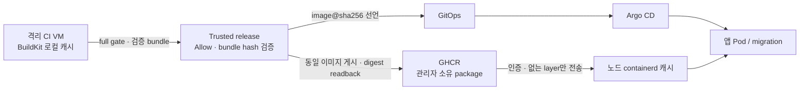

# 이미지 레지스트리·캐시 계약

결정: **2026-10-01 — 제품 이미지 레지스트리는 GHCR(`ghcr.io`)로 고정**한다. 사용자의 최종 지시로 앞선 Harbor 검토를 대체했다. 별도 Harbor/registry VM은 만들지 않는다. OCI 이미지·digest·기존 공통 publisher를 사용해 AWS/GCP/Azure/온프렘의 배포 코드는 공유한다. GHCR의 계정·권한·가용성 의존성까지 없다는 뜻은 아니다.

## 실행 경계

이는 배포 계약이며 전체 GHCR 경로의 실제 인수 완료를 뜻하지 않는다. CI 중지 후에도 앱의 재시작·스케일아웃은 GHCR에 접근할 수 있어야 한다. 노드의 kubelet/containerd가 이미지를 당기므로 Pod egress 규칙만으로 pull 경계를 통제하지 않는다.

| 소비자 | 받는 값·권한 | 받지 않는 것 |
|---|---|---|
| 비신뢰 CI | source·build 도구·로컬 cache, 검증 bundle 출력 | registry push, GitOps write, 모델 인증 |
| GitHub Actions release | 보호된 환경의 GHCR prefix, 해당 package에 허용된 `GITHUB_TOKEN` / `packages: write` | 사용자 지정 registry/auth 명령 |
| VM/CodeBuild의 trusted publisher | 기존 private authfile, 해당 package 접근이 제한된 별도 게시 자격 | 사용자 CI와 인증 공유 |
| 앱·migration | 같은 namespace의 pull Secret, package 읽기 권한만 가진 자격 | 게시 자격, 다른 tenant package 접근 |
| Argo observer | 배포 상태 get-only | Secret 생성·조회, 인증 발급 |

GitHub Actions에서는 `GITHUB_TOKEN`을 우선한다. 외부 VM 인증은 현재 GHCR이 지원하는 PAT classic의 필요한 package scope와 실제 package 권한을 함께 제한해야 한다. `read:packages`라는 scope 이름만으로 tenant별 권한이 분리됐다고 판단하지 않는다. 새 package는 기본 private이며, `public` 설정값이 실제 package를 공개로 바꾸지는 않는다. [GHCR 공식 인증·공개 범위](https://docs.github.com/en/packages/working-with-a-github-packages-registry/working-with-the-container-registry)

## 기존 인터페이스를 재사용한다

- 게시 코드는 `platform/gate/bundle.py`의 `publish(bundle, registry_prefix, tag, backend="skopeo", authfile=...)`다. GHCR 전용 이미지 빌더는 추가하지 않는다. 기존 CodeBuild/ECR 경로는 독립 실험이며 제품 기본이 아니다.
- 제품 namespace는 관리자 조직의 `ghcr.io/jasmin-softbank/<tenant>-<app>-<service>@sha256:<digest>`를 기준으로 한다. protected 환경/target에 prefix를 등록하고 업로드·LLM 출력에서는 받지 않는다. GitOps에는 tag 대신 원격에서 확인한 digest를 쓴다.
- 계획에는 registry prefix, `registry_visibility`와 pull Secret 이름을 묶는다. visibility의 기본은 `private`이며 public은 관리자 명시가 필요하다. Secret 원문과 authfile 내용은 브라우저·plan·Git·prompt·bundle에 넣지 않는다.
- private 대상은 Secret 이름 누락, 미설치 또는 검증 경계 미연결 상태에서 차단한다. 이름이 있다는 사실을 준비 완료로 간주하지 않는다. 현재 namespace Secret installer/검증 경계가 없어 private release는 미지원 상태다.
- 준비되지 않은 계획은 사유를 표시하고 Allow를 소비하지 않는다. executor도 같은 전제를 재검사한다. public-only workflow는 별도 빈 인증 설정으로 게시 digest를 조회한 뒤 GitOps로 진행하며, 공개 전환을 자동 수행하지 않는다.
- 인증/TLS/설정의 명시적 실패는 시작 전 `BLOCKED`, push 시작 뒤 불확실한 결과는 `UNKNOWN`이다. journal과 immutable digest로 조정하기 전 자동 재시도하지 않는다.

`imagePullSecrets`는 Pod와 같은 namespace에 있어야 한다. Deployment와 같은 앱 이미지의 migration Job 양쪽에 전달한다. 노드 전체 GHCR credential은 tenant 격리가 아니며 기존 노드 파일의 삭제·회전은 별도 유지보수다. [Kubernetes private pull 규약](https://kubernetes.io/docs/tasks/configure-pod-container/pull-image-private-registry/)

## 캐시는 세 경계로 나눈다

| 계층 | 결정 | 현재 범위 |
|---|---|---|
| CI BuildKit 로컬 캐시 | 같은 tenant/작업 VM에서 이전 layer 재사용. registry push 자격 불필요 | builder의 `/var/lib/buildkit` named volume 구현. VM/volume 교체 시에는 cache miss로 빌드 |
| GHCR 원격 build cache | 기존 검증 이미지의 inline metadata부터 실험; 필요하면 별도 registry cache ref | 아직 연결하지 않음. 사라지는 VM의 cold build 비용을 측정한 뒤 도입 |
| 앱 노드 containerd 캐시 | digest로 이미지 고정, 이미 받은 layer 재사용 | 앱과 migration에 `imagePullPolicy: Always` 명시. 인증/resolve 후 없는 layer만 내려받음 |

`Always`는 매번 전체 이미지를 다시 다운로드한다는 뜻이 아니다. 시작 시 registry에 접근하고, 동일 layer가 로컬에 있으면 재사용한다. 이 선택은 캐시가 private 인증 설정 오류를 가리는 일을 줄이지만 **registry 장애 중 새로운 Pod 시작은 실패할 수 있다.** 이미 실행 중인 컨테이너의 지속 실행과 새 Pod의 시작을 구별한다. [Kubernetes pull·캐시 동작](https://kubernetes.io/docs/concepts/containers/images/)

원격 cache의 첫 실험 후보는 `--cache-to type=inline`이다. cache metadata를 이미지에 포함해 기존 검증→bundle→trusted publisher 경로를 재사용한다. 다음 빌드는 관리자가 선택한 동일 tenant/app의 성공 digest를 `--cache-from type=registry`로 참조한다. 현재 `--load → docker save → Skopeo` 전달에서 metadata 보존과 native cache hit는 아직 검증하지 않았다. 복잡한 multi-stage에서는 inline 효율이 제한된다. [BuildKit inline cache](https://docs.docker.com/build/cache/backends/inline/)

inline으로 부족할 때만 `--cache-to type=registry`의 별도 package/ref를 사용한다. 예시는 `ghcr.io/jasmin-softbank/<tenant>-<app>-buildcache:<build-profile>`이다. profile은 architecture·선택한 build root·Dockerfile/lock/toolchain 조건에 결합하고, branch/신뢰 수준·tenant 간 쓰기 경계를 공유하지 않는다. `mode=max`는 중간 stage도 내보내므로 접근 범위와 보존량 검토 없이 기본 활성화하지 않는다. [BuildKit registry cache](https://docs.docker.com/build/cache/backends/registry/)

비신뢰 CI에 GHCR push token을 주면서 remote cache를 켜지 않는다. private cache의 최소 pull 자격도 지금의 자격 없는 CI 경계에 임의로 주입하지 않는다. trusted fetch→검증된 artifact 전달 또는 안전하게 격리한 인증 경계를 먼저 검증한다. 현재 publisher는 완성 이미지 bundle만 받고 별도 BuildKit cache artifact는 받지 않으므로 `mode=max` 전송은 추가 계약이 필요하다. cache miss나 소실은 재빌드로 처리하며 검사 결과·Allow·배포 성공 증거는 cache로 대체하지 않는다.

BuildKit GC와 kubelet image GC는 각자의 캐시를 관리한다. 캐시는 삭제 가능한 데이터이며 원본 source, 검증 receipt, 현재 배포/LKG digest 보존과 분리한다. 공유 `docker system prune`이나 실행 중 VM의 무차별 cache 삭제는 사용하지 않는다. 명시적인 용량/미사용 기간 정책을 적용할 때는 pinned BuildKit 판본과 디스크 여유를 확인한다. [BuildKit GC](https://docs.docker.com/build/cache/garbage-collection/)

현재 남은 두 한계는 GAP 원장에 등록한다. 첫째, BuildKit GC가 관리하지 않는 `--load` 이미지와 job별 bundle의 총 디스크 보존·정리 정책은 없다. 둘째, builder와 volume이 VM 전체에서 고정돼 있어 workspace별 cache 격리가 아니다. 다른 tenant에게 VM을 재할당하기 전 소유권/초기화 검증이 필요하다. Q의 의존성 캐시와 L4의 Trivy DB도 현재 run별 임시 저장소이므로 지속 캐시가 아니다.

## 배포와 수명

- GHCR의 이미지 수명은 CI VM·앱 Pod 수명과 독립이다. 사용자 작업 VM의 STOP/delete가 package 삭제로 이어지지 않는다.
- 같은 retained disk로 VM을 stop/start하면 로컬 캐시가 남을 수 있지만, GC·재프로비저닝·새 노드에서는 항상 cold pull/build가 가능해야 한다. cache hit를 준비 완료의 증거로 삼지 않는다.
- 현재 배포 및 LKG가 사용하는 digest는 보존한다. cache package의 만료/GC와 release image 삭제 정책은 분리한다. 이 참조 보호 자동화는 아직 미구현이다.
- 단일 앱 노드 PoC에는 별도 registry mirror/분산 cache 서버를 추가하지 않는다. 다수 노드의 동시 pull 병목·전송비가 실측되면 재검토한다.

## 인수 기준과 상태

1. 같은 source의 cold/warm build를 비교해 L2 시간·실제 cache hit·최종 image ID를 기록한다. 두 실행 모두 필수 gate를 통과해야 한다. 현재 성능 개선 수치를 주장하지 않는다.
2. cache 없는 새 노드에서 private GHCR digest pull과 앱 기동을 확인한다. 같은 노드의 warm 재시작에서 누락 layer 전송 여부와 시간을 비교한다.
3. 잘못된/만료된 자격과 다른 tenant의 package 접근은 실패해야 한다. warm cache가 있어도 인증 실패를 성공으로 보고하지 않는다.
4. cache 제거·VM 재생성 시 cold 경로가 작동하고, 현재 배포/LKG 이미지와 증거가 보존되는지 확인한다.
5. Allow → 동일 이미지 게시 → GitOps → Argo exact revision → Pod imageID → external HTTPS → LKG의 실제 인수를 완료한다.

현재 **GHCR 제품 게시·private pull·cold/warm 성능 인수는 NOT_RUN**이다. 공통 publisher·trusted target·renderer·워크플로 정책은 로컬 검증 대상이다. 기존 CodeBuild/ECR 첫 실험은 native FAILED/dispatcher UNKNOWN이며, 추가 실행은 보류했다. 기존 ECR·Artifact Registry 자원을 자동 삭제하지 않았다. GitOps 접근 404도 별도 장애로 남아 있다.
